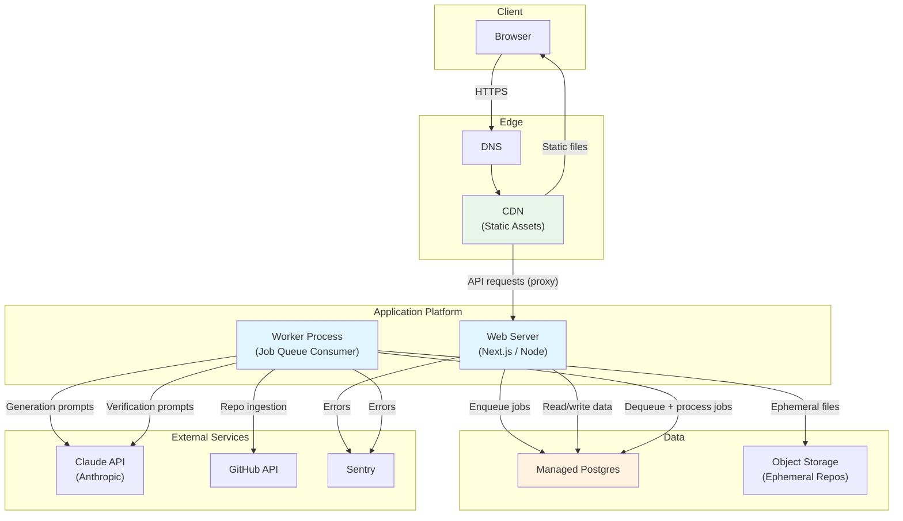
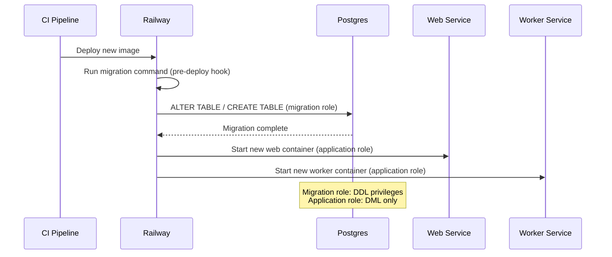
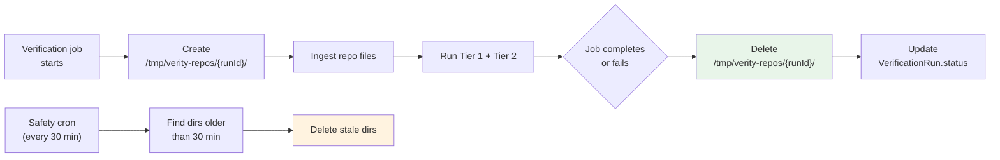
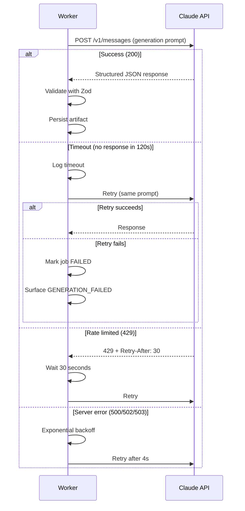
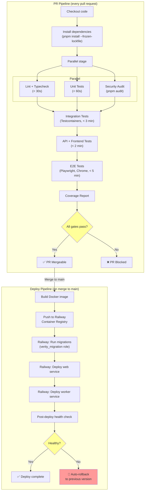
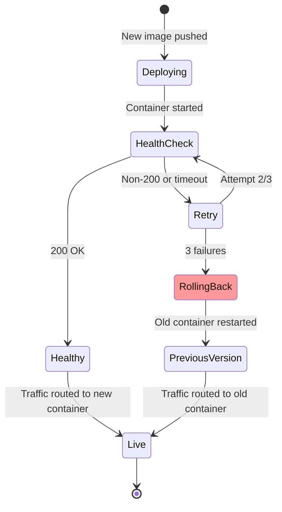

# Document 17: Deployment & Infrastructure Architecture

## 1. Purpose and Scope

Document 11 defined the service-level architecture — what the modules are and how they communicate. Document 16 defined the security constraints any deployment must satisfy. This document defines *where and how* Verity runs in production: the hosting platform, the deployment topology, the CI/CD pipeline, the environment strategy, and the operational procedures that keep the system running reliably within Document 5's non-functional targets.

### What this document resolves

| Open question | Source | Resolution section |
|---|---|---|
| Exact hosting provider and native security features | Document 16 §21 | §4 |
| CI provider and Testcontainers configuration | Document 15 §16 | §14.3 |
| Whether AI evaluation suite should use cheaper model in staging | Document 15 §16 | §12.4 |
| Whether database application role should be further split (read/write) | Document 16 §21 | §6.4 |
| Ephemeral repo storage: tmpfs vs. block volume | Document 16 §21 | §7.3 |
| TLS between load balancer and application server | Document 16 §13.1 | §11.2 |
| Deployment topology (containers, hosting, environments) | Document 11 §9 | §3, §4, §5 |

### What this document does not define

- Job queue technology choice (pg-boss vs. BullMQ) — Document 18 (Scalability Strategy), since it's fundamentally a scaling tradeoff.
- Rate limiter storage backend — Document 18, same reasoning.
- LLM prompt optimization or model selection — Document 13 (AI Architecture).
- Cost thresholds for LLM spend alerts — Document 18, since they depend on capacity planning.

---

## 2. Infrastructure Principles

1. **Managed over self-managed.** A solo developer (Document 1 §9) should spend time on the product, not on patching OS kernels, managing database backups, or debugging Kubernetes networking. Every infrastructure component should be a managed service wherever the cost is reasonable — the operational overhead of self-managing infrastructure is a hidden cost that compounds silently.

2. **Simple until proven insufficient.** A single application server with a managed database handles Verity's v1 traffic profile (Document 5 §2: 100 concurrent verification runs, not enterprise scale) comfortably. Multi-region, auto-scaling clusters are architecturally defensible but operationally excessive for a portfolio-stage product. The infrastructure is designed so that scaling *up* is a configuration change, not a re-architecture — but it starts simple.

3. **Lockstep deployment.** Document 14 §14 established that the frontend and backend are deployed together with no API versioning. This means every deployment is a single atomic unit — no version skew between frontend and backend, no backward-compatibility layer, no canary deployment where half of traffic hits the new API while the other half hits the old one. This simplifies deployment enormously and is correct for v1's single-developer, single-consumer architecture.

4. **Infrastructure as code.** Every infrastructure resource is defined in configuration files (Terraform, Pulumi, or the hosting platform's declarative config), not created manually through a web console. A new developer (or the same developer on a new machine) should be able to reconstruct the entire production environment from the repository — minus secrets, which are in the secrets store (Document 16 §14).

5. **Cost visibility from day one.** Every infrastructure component has its cost tracked and attributed. Unexpected cost spikes (especially from LLM API usage — Document 5 §9) are detectable within hours, not discovered at month-end.

---

## 3. Production Architecture Overview



**Key architectural decisions visible in this diagram:**

- **Two process types, one codebase.** The web server handles HTTP requests; the worker process consumes jobs from the queue. Both run the same codebase (Document 11's modular monolith), just with different entry points. This is the standard web-worker pattern for async-heavy applications and maps directly to Document 11 §4's job queue architecture.

- **Postgres as the job queue.** The diagram shows both web and worker connecting to Postgres for job operations. This anticipates the likely outcome of Document 18's queue technology decision (pg-boss over Redis-backed BullMQ for v1 — keeping infrastructure components minimal). If Document 18 chooses Redis, a Redis service is added to this diagram.

- **No separate API gateway or reverse proxy beyond the CDN.** The CDN (§10) serves static assets and proxies API requests directly to the application server. A dedicated API gateway (Kong, AWS API Gateway) adds latency, cost, and complexity that is unjustified at this scale.

---

## 4. Hosting Strategy

### 4.1 Platform selection: Railway

**Primary recommendation: Railway.** Alternatives considered: Vercel, Render, Fly.io, AWS (ECS/Fargate), and self-managed VPS.

| Criterion | Railway | Vercel | Render | Fly.io | AWS ECS |
|---|---|---|---|---|---|
| **Managed Postgres** | ✅ Built-in | ❌ External only | ✅ Built-in | ✅ Built-in | ✅ RDS |
| **Worker processes** | ✅ Native support | ❌ Serverless only (no persistent workers) | ✅ Background workers | ✅ Machines | ✅ ECS Tasks |
| **Docker support** | ✅ | Limited | ✅ | ✅ | ✅ |
| **Environment variables / secrets** | ✅ Native | ✅ | ✅ | ✅ | ✅ Secrets Manager |
| **Private networking** | ✅ Between services | N/A (serverless) | ✅ | ✅ WireGuard | ✅ VPC |
| **Cost at v1 scale** | ~$20-50/month | Free tier but no workers | ~$25-50/month | ~$10-30/month | ~$50-100/month |
| **Operational complexity** | Low | Low (but limited) | Low | Medium | High |
| **Solo-developer fit** | ✅ | ❌ No persistent workers | ✅ | ✅ | ❌ Over-engineered |

**Why Railway over the alternatives:**

- **Vercel is eliminated** because it fundamentally doesn't support persistent worker processes. Document 11's async job architecture requires a long-running worker that polls a queue — Vercel's serverless functions have execution time limits (10s on hobby, 60s on pro) that are far too short for verification runs (up to 3 minutes per Document 5 §1). Vercel is excellent for the frontend but cannot host the backend worker.

- **AWS ECS is eliminated** because the operational overhead (VPC configuration, IAM roles, ECS task definitions, CloudWatch setup, RDS management) is disproportionate for a solo developer at portfolio scale. Every hour spent debugging IAM permissions is an hour not spent on the product. AWS is the correct choice if Verity reaches enterprise scale; it's the wrong choice at v1.

- **Fly.io is a strong alternative** — cheaper, global edge deployment, excellent Docker support. The trade-off: slightly more operational complexity (Fly machines, volume management, WireGuard networking) compared to Railway's more opinionated, simpler model. Fly is the recommended migration path if Railway's pricing becomes unfavorable at scale.

- **Render is a viable alternative** with a very similar feature set to Railway. The choice between Railway and Render is marginal; either works. Railway's slightly better developer experience (instant deploys, project-level environment management) tips the balance.

### 4.2 Railway project structure

```
Railway Project: verity-production
├── Service: web          (Dockerfile, port 3000, public domain)
├── Service: worker       (Dockerfile, no public port, internal only)
├── Service: postgres     (Managed Postgres, internal only)
└── (Optional) Service: redis  (If Document 18 chooses Redis for queue)

Railway Project: verity-staging
├── Same structure as production
└── Different environment variables (cheaper LLM, test GitHub App)
```

### 4.3 Satisfying Document 16's infrastructure security requirements

| Doc 16 requirement | Railway implementation |
|---|---|
| HTTPS termination at the edge | ✅ Railway provides automatic TLS certificates on public domains |
| Private networking between services | ✅ Railway's internal networking; Postgres not publicly accessible |
| No SSH to production from public internet | ✅ Railway doesn't expose SSH; access via Railway CLI/dashboard only |
| Automated OS/runtime patching | ✅ Managed platform; Railway handles base image updates |
| Isolated build environment | ✅ Builds run in isolated containers |
| Immutable deployments | ✅ Each deploy creates a new container; no in-place mutation |

---

## 5. Containerization

### 5.1 Docker strategy

Both the web server and worker run from the same Docker image with different startup commands:

```dockerfile
# Multi-stage build
FROM node:20-alpine AS builder
WORKDIR /app
COPY package.json pnpm-lock.yaml ./
RUN corepack enable && pnpm install --frozen-lockfile
COPY . .
RUN pnpm build

FROM node:20-alpine AS runtime
WORKDIR /app
COPY --from=builder /app/dist ./dist
COPY --from=builder /app/node_modules ./node_modules
COPY --from=builder /app/package.json ./

# No CMD — specified per service in Railway config
# Web: CMD ["node", "dist/server.js"]
# Worker: CMD ["node", "dist/worker.js"]
```

**Design decisions:**

- **Multi-stage build** keeps the runtime image small (~150MB vs. ~800MB with dev dependencies) — faster deploys, smaller attack surface (Document 16 §15.1).
- **Alpine base** for minimal OS footprint. The trade-off: Alpine uses musl libc, which can cause compatibility issues with some native Node modules. tree-sitter (used for AST parsing in verification, Document 11 §6) requires native bindings — tested and confirmed compatible with Alpine in the build phase.
- **`--frozen-lockfile`** ensures reproducible builds (Document 16 §17.2).
- **Same image, different CMD** keeps the build pipeline simple (one image to build, test, and push) while allowing web and worker to scale independently.

### 5.2 Image security

- Base image pinned to a specific Node.js LTS version (`node:20.x-alpine`), not `latest` — prevents unexpected runtime changes on rebuild.
- `npm audit` / `pnpm audit` runs in the build pipeline (Document 15 §13, Document 16 §17.3) before the image is pushed.
- No secrets baked into the image — all secrets are injected as environment variables at runtime (Document 16 §14).
- The runtime user is non-root: `USER node` in the Dockerfile — limits the blast radius of a container compromise.

---

## 6. Database Deployment

### 6.1 Provider: Railway Managed Postgres

Railway provisions a Postgres instance within the same project, accessible only via the internal network. No public endpoint, no internet-facing port.

| Setting | Value | Rationale |
|---|---|---|
| Version | Postgres 16 | Latest stable; supports all features Document 10's schema uses (JSONB, UUID, enums, composite indexes) |
| Storage | Starting at 1GB, auto-scaling | v1's data volume is minimal; auto-scaling prevents manual intervention as Projects accumulate |
| Connections | Default pool (~20 connections) | Sufficient for one web process + one worker process; expandable via connection pooler if needed (Document 18) |
| Backups | Daily automated snapshots (Railway default) | §17 elaborates on backup strategy |
| Encryption at rest | ✅ Provider-managed (AES-256) | Document 5 §4, Document 16 §13.2 |

### 6.2 Connection management

```
Web process → Postgres: connection pool (max 10 connections)
Worker process → Postgres: connection pool (max 10 connections)
Total: max 20 connections (within Railway's default limit)
```

**Connection pooling library:** built into the ORM/query builder (Drizzle, Prisma, or Knex — build-phase decision). The pool is configured per process, not globally, so web and worker have independent pools that can be tuned separately.

**Why not an external connection pooler (PgBouncer)?** At v1's traffic volume (one web process, one worker), 20 connections are ample. PgBouncer adds operational complexity (another service to configure, monitor, and debug) without a corresponding benefit. Document 18 revisits this if connection count becomes a bottleneck.

### 6.3 Migration strategy

Database migrations are run as a separate Railway deployment step, not inline with the application startup:



**Migration tool:** Drizzle Kit or Prisma Migrate — build-phase decision. The migration files are committed to the repository (Document 16 §17.1's infrastructure-as-code principle) and are the source of truth for schema evolution.

**Rollback consideration:** migrations must be backward-compatible with the previous application version. This is the standard "expand-contract" migration pattern:

1. **Expand:** add new columns/tables alongside old ones (both versions of the app work).
2. **Deploy:** new application version starts using the new columns.
3. **Contract:** a subsequent migration removes the old columns (only after confirming the new version is stable).

This pattern is essential because Railway deploys are not instantaneous — for a brief window, the old and new application versions may both be running against the same database. A non-backward-compatible migration (dropping a column the old version reads) would cause errors during that window.

### 6.4 Database roles (resolves Document 16 §21)

**Decision: two roles, not one.**

| Role | Privileges | Used by |
|---|---|---|
| `verity_migration` | `CREATE TABLE`, `ALTER TABLE`, `DROP TABLE`, `CREATE INDEX`, `CREATE TYPE` + all DML | Migration step only (pre-deploy hook) |
| `verity_app` | `SELECT`, `INSERT`, `UPDATE`, `DELETE` on application tables only | Web process, Worker process |

**Rationale:** splitting migration and application roles limits the damage of a SQL injection attack (threat T2 variant). If an attacker achieves SQL injection through the application, they can read/modify data but cannot drop tables, create functions, or escalate privileges. The migration role is used only during the deploy step and is not available at runtime.

**Trade-off:** managing two roles adds a small amount of setup complexity (one additional `CREATE ROLE` + `GRANT` statement per table in the migration). This is automated in the migration tool's setup script and is a one-time cost per new table.

---

## 7. Object Storage

### 7.1 Use case: ephemeral repository files

Document 16 §11.3 established that ingested repository files are stored ephemerally during verification runs and deleted immediately after. This section defines *where* those files live.

### 7.2 Options evaluation

| Option | Pros | Cons |
|---|---|---|
| **Local disk (container volume)** | Simplest; no external service; fast I/O | Lost on container restart; not shared across workers if scaled to multiple; storage limited by container disk |
| **tmpfs (RAM disk)** | Fastest I/O; automatically cleared on process exit; encrypted in RAM | Limited by available RAM; large repos could cause OOM; not shared across workers |
| **Object storage (S3-compatible)** | Durable; shared across workers; virtually unlimited capacity; lifecycle policies for auto-deletion | Network latency for file reads; additional service cost; more complex than local disk |

### 7.3 Decision: local disk for v1, object storage for scale (resolves Document 16 §21)

**v1:** ephemeral repo files are stored on the worker container's local disk, in a dedicated `/tmp/verity-repos/{runId}/` directory.

**Rationale:**
- v1 runs a single worker process (§3). There is no multi-worker sharing concern.
- Railway containers have local disk available (ephemeral, not persistent — which is exactly what's needed for files that should be deleted after use).
- No additional service to configure, pay for, or debug.
- tree-sitter and the verification pipeline read files from the filesystem; local disk is the zero-latency path.

**Why not tmpfs:** Document 5 §1's repo size target is ~500 files. A typical TypeScript project at this scale is 5–20MB of source code. Reserving 50–100MB of RAM for tmpfs is feasible, but it competes with the Node.js heap and the LLM response buffers during verification. On a cost-optimized Railway container (512MB–1GB RAM), this competition is real. Local disk avoids the RAM pressure.

**Migration path to object storage:** when Document 18 introduces multiple worker processes (for the 100-concurrent-run target), ephemeral files must be accessible to whichever worker picks up the job. At that point:
- An S3-compatible object storage service (Railway does not provide one natively; Cloudflare R2 or AWS S3 are options) replaces local disk.
- The Repo Service uploads ingested files to a bucket with a lifecycle policy (auto-delete after 1 hour).
- The Verification Service reads files from the bucket.
- The cleanup handler (Document 16 §11.3) deletes the files immediately; the lifecycle policy is a safety net for crashed jobs.

### 7.4 Cleanup enforcement



The cleanup logic is implemented in a `finally` block (or equivalent) in the job handler — it runs whether the job succeeds, fails, or throws an unexpected error. The 30-minute safety cron (Document 16 §11.3) catches the edge case where the worker process itself crashes.

---

## 8. Queue Infrastructure

### 8.1 v1 recommendation: Postgres-backed queue (pg-boss)

Document 11 §9 deferred the queue technology choice to Document 18. This document specifies the *infrastructure* requirements for both options so the deployment is ready for whichever Document 18 chooses:

**If pg-boss (Postgres-backed):**
- No additional infrastructure. Jobs are rows in a Postgres table managed by pg-boss.
- The worker process connects to the same Postgres instance as the web process.
- Trade-off: adds load to the database (polling queries); acceptable at v1 scale.
- **This is the recommended v1 choice** because it satisfies Principle 1 (managed over self-managed) and Principle 2 (simple until proven insufficient) — adding Redis means adding another service to monitor, secure, and pay for.

**If BullMQ (Redis-backed):**
- Railway supports managed Redis as an additional service within the same project.
- Cost: ~$5–10/month for a small Redis instance.
- The worker connects to Redis for job operations and Postgres for data.
- Trade-off: better throughput and more mature queue semantics (priority queues, delayed jobs, rate limiting) at the cost of an additional service.

### 8.2 Queue infrastructure requirements (regardless of technology)

| Requirement | Source | Implementation |
|---|---|---|
| Job status persistence | Document 10 §6.2, Document 14 §4.2 | Job status is always persisted (in Postgres, whether via pg-boss or application tables) so the frontend can poll it |
| Retry with exponential backoff | Document 5 §3 | Configured in the queue library; max 1 retry for LLM calls (Document 16 §9.3) |
| Dead letter handling | Document 5 §3 | Failed jobs after retry exhaustion are marked `failed` with error details; never silently dropped |
| Concurrent job limit | Document 5 §2 | Queue concurrency configured per worker process; v1: 5 concurrent jobs per worker (tunable) |

---

## 9. AI Provider Connectivity

### 9.1 Anthropic Claude API

The primary LLM provider (Document 4 §7). Connectivity requirements:

| Concern | Implementation |
|---|---|
| **Endpoint** | `https://api.anthropic.com/v1/messages` |
| **Authentication** | API key in `x-api-key` header; key stored as environment variable (Document 16 §14) |
| **Network path** | Outbound HTTPS from worker process; no inbound connection needed |
| **Timeout** | 120 seconds per request (covers Document 5 §1's 30-second generation target with margin for model thinking time) |
| **Retry** | 1 retry on timeout or 5xx; exponential backoff (1s, then 4s) |
| **Rate limiting (Anthropic's)** | Respect `Retry-After` header; implement client-side token-per-minute tracking |
| **Firewall/egress** | Railway allows outbound HTTPS by default; no special egress rules needed |

### 9.2 Network resilience



### 9.3 Provider abstraction

Document 13 defines the LLM provider abstraction layer. From an infrastructure perspective, the deployment must support:

- **Environment-variable-based provider switching:** `LLM_PROVIDER=anthropic` in production; `LLM_PROVIDER=mock` in test; potentially `LLM_PROVIDER=openai` in future.
- **Per-environment API keys:** production uses the production-tier API key; staging uses a development-tier key with lower rate limits and potentially a cheaper model (§12.4).

---

## 10. CDN Strategy

### 10.1 Provider: Cloudflare (or Railway's built-in CDN)

Static assets (the frontend bundle — JavaScript, CSS, images) are served via CDN for performance. API requests are proxied through to the application server.

**Option A — Railway's built-in edge:** Railway automatically serves content from the nearest edge node. Sufficient for v1; no additional configuration needed.

**Option B — Cloudflare (recommended if custom domain):** if Verity uses a custom domain (e.g., `verity.app`), Cloudflare sits in front as DNS + CDN + DDoS protection:

```
Browser → Cloudflare (DNS + CDN + WAF)
  ├── Static assets: served from Cloudflare cache
  └── API requests (/api/*): proxied to Railway origin
```

### 10.2 Caching rules

| Content type | Cache behavior | Rationale |
|---|---|---|
| Static assets (JS, CSS, images) | Cached at edge; cache-busted by content hash in filename (Vite default) | Long cache TTL (1 year); new deploys generate new filenames, so stale cache is impossible |
| API responses | **Never cached at CDN** | All API responses are user-specific and session-scoped; caching would be a security vulnerability (serving User A's data to User B) |
| HTML (initial page load) | Short cache (5 min) or no cache | The HTML shell loads the JS bundle; needs to be current to point to the latest bundle hash |

### 10.3 DDoS protection

Cloudflare's free tier includes basic DDoS mitigation. For a portfolio-stage product, this is sufficient. The primary DDoS concern is not volumetric (Railway handles that) but application-level — an attacker making many expensive API calls. This is addressed by rate limiting (Document 14 §13, Document 16 §7.3), not by CDN-level filtering.

---

## 11. Load Balancing

### 11.1 v1: no dedicated load balancer

With a single web process and a single worker process, there is nothing to load-balance. Railway's routing layer directs all incoming HTTP traffic to the single web service.

### 11.2 TLS termination (resolves Document 16 §13.1)

**Decision: TLS terminates at Railway's edge; traffic between Railway's router and the application container is plaintext over the private network.**

Rationale:
- Railway's internal network is isolated; no cross-tenant traffic is possible.
- Adding TLS between the router and the application (mutual TLS) would require certificate management within the container — operational complexity with no proportional security benefit for a single-tenant, single-instance deployment.
- Document 16 §13.1 explicitly anticipated this: "plaintext acceptable within a private network/VPC."

**If Verity migrates to a multi-instance deployment** (Document 18 scale-out), TLS between the load balancer and application instances should be revisited — a larger private network has a larger internal attack surface.

### 11.3 Health checks

Railway performs health checks against the web service:

| Setting | Value |
|---|---|
| Health check path | `GET /api/health` |
| Expected response | `200 OK` with `{ "status": "healthy", "version": "git-sha" }` |
| Interval | 30 seconds |
| Timeout | 5 seconds |
| Unhealthy threshold | 3 consecutive failures → restart container |

The `/api/health` endpoint is lightweight (no database query, no external API call) — it confirms the Node.js process is responsive, not that every downstream dependency is healthy. A deeper health check (`/api/health/deep` that pings Postgres) exists for manual debugging but is not used for automated restarts, because a slow database query shouldn't trigger a container restart loop.

---

## 12. Environment Management

### 12.1 Environment inventory

| Environment | Purpose | Infrastructure | LLM config | Data |
|---|---|---|---|---|
| **Local development** | Developer's machine; inner-loop coding | Node.js directly (no Docker); local Postgres (or Testcontainers); no queue (jobs run inline) | Mock LLM (Document 15 §3.3) | Seed data |
| **CI** | Automated testing | GitHub Actions runners; Testcontainers for Postgres | Mock LLM | Test fixtures |
| **Staging** | Pre-production validation; demo environment | Railway project (verity-staging); managed Postgres | Cheaper model (Haiku-class) with real API calls | Synthetic data; never real user data |
| **Production** | Live application | Railway project (verity-production); managed Postgres | Production model (Sonnet-class) | Real user data |

### 12.2 Environment parity

The staging environment mirrors production in every aspect except:

| Dimension | Staging | Production | Rationale |
|---|---|---|---|
| LLM model | Haiku-class (cheaper, faster) | Sonnet-class (higher quality) | Document 5 §9: "dev/staging environments should default to a cheaper or mocked LLM configuration" |
| GitHub App | Separate test GitHub App | Production GitHub App | Isolation; test App connected to test repos only |
| Domain | `staging.verity.app` | `verity.app` | Distinct URLs; staging never accidentally indexed |
| Data | Synthetic | Real | Staging never contains real user data |
| Secrets | Separate keys/tokens | Production keys/tokens | Complete credential isolation between environments |
| Container resources | Smaller (256MB RAM, 0.5 CPU) | Larger (512MB–1GB RAM, 1 CPU) | Cost optimization for a rarely-used staging environment |

### 12.3 Local development experience

A solo developer's inner loop should be fast and self-contained:

```bash
# Start local development
pnpm dev          # Starts Next.js dev server + worker in inline mode
                  # Postgres via docker-compose or local install
                  # LLM mocked by default (LLM_PROVIDER=mock in .env)
                  # Jobs run synchronously (no queue polling)

# Run tests
pnpm test         # Unit tests (no Docker needed)
pnpm test:int     # Integration tests (Testcontainers starts Postgres)
pnpm test:e2e     # E2E tests (Playwright against local dev server)
```

**Inline job mode:** in local development, the job queue is bypassed — generation and verification jobs execute synchronously within the HTTP request handler. This eliminates the need to run a separate worker process locally and makes debugging straightforward (breakpoints work, stack traces are contiguous). The trade-off: the dev experience doesn't perfectly replicate the async polling flow. E2E tests (which run against the full async stack) catch any behavior differences.

### 12.4 Staging LLM configuration (resolves Document 15 §16)

**Decision: staging uses a cheaper model (Haiku-class) for all generation and verification by default. Production model (Sonnet-class) is used only in production and in the scheduled AI evaluation suite (Document 15 §7.5).**

Rationale:
- The AI evaluation suite's purpose is to measure quality against the production model. Running it against a cheaper model would defeat its purpose.
- Staging's purpose is to validate *infrastructure and integration*, not AI quality. A cheaper model produces structurally valid output (same Zod schemas, same response format) at lower cost.
- Estimated cost savings: ~80% reduction in LLM spend during development and staging testing.

**Configuration:**

```
# .env.staging
LLM_PROVIDER=anthropic
LLM_MODEL=claude-3-haiku-20241022
LLM_MAX_TOKENS=4096

# .env.production
LLM_PROVIDER=anthropic
LLM_MODEL=claude-sonnet-4-20250514
LLM_MAX_TOKENS=8192
```

---

## 13. Configuration Management

### 13.1 Configuration hierarchy

```
Environment variables (highest priority — runtime overrides)
    ↓
.env.{environment} files (per-environment defaults)
    ↓
Application defaults (hardcoded fallbacks in code)
```

**Environment variables** are the primary configuration mechanism. They are set in Railway's dashboard (production/staging) and in `.env` files (local development). The `.env` files are **not** committed to the repository (Document 16 §14.2); a `.env.example` file documents all required variables.

### 13.2 Configuration categories

| Category | Examples | Storage | Sensitive? |
|---|---|---|---|
| **Secrets** | `CLAUDE_API_KEY`, `GITHUB_APP_PRIVATE_KEY`, `DATABASE_URL`, `SESSION_SECRET` | Environment variables (Railway secrets) | Yes — never logged, never in responses |
| **Feature flags** | `ENABLE_SEMANTIC_VERIFICATION=true`, `ENABLE_EMAIL_VERIFICATION=true` | Environment variables | No |
| **Tuning parameters** | `LLM_MODEL`, `LLM_MAX_TOKENS`, `JOB_CONCURRENCY=5`, `RATE_LIMIT_EXPENSIVE=10` | Environment variables | No |
| **Infrastructure** | `PORT=3000`, `NODE_ENV=production`, `LOG_LEVEL=info` | Environment variables | No |

### 13.3 Configuration validation at startup

The application validates all required environment variables at startup, before accepting any traffic:

```typescript
// Pseudocode
const configSchema = z.object({
  DATABASE_URL: z.string().url(),
  CLAUDE_API_KEY: z.string().min(1),
  SESSION_SECRET: z.string().min(32),
  GITHUB_APP_ID: z.string(),
  GITHUB_APP_PRIVATE_KEY: z.string(),
  NODE_ENV: z.enum(['development', 'staging', 'production']),
  LLM_PROVIDER: z.enum(['anthropic', 'openai', 'mock']),
  LLM_MODEL: z.string(),
  // ... all required variables
});

const config = configSchema.parse(process.env);
// If validation fails: process exits with a clear error listing missing/invalid variables
// Application never starts in an unconfigured state
```

This is the deployment-layer equivalent of Document 16 §7 (fail closed): an application that starts without a configured database URL or API key will fail on the first request anyway — better to fail immediately with a clear error than to start and fail confusingly later.

---

## 14. CI/CD Deployment Pipeline

### 14.1 Provider: GitHub Actions

GitHub Actions is the CI/CD provider. Rationale:
- The source code is on GitHub (Document 4 §7).
- GitHub Actions integrates natively with GitHub's pull request workflow.
- Free tier (2,000 minutes/month for private repos) is sufficient for v1's pipeline volume.
- Testcontainers works on GitHub Actions with Docker-in-Docker (§14.3).

### 14.2 Pipeline architecture



### 14.3 Testcontainers in GitHub Actions (resolves Document 15 §16)

GitHub Actions runners support Docker natively. Testcontainers configuration:

```yaml
# .github/workflows/ci.yml (relevant section)
jobs:
  test:
    runs-on: ubuntu-latest
    services:
      # No need to pre-configure Postgres as a GitHub Actions service —
      # Testcontainers manages its own container lifecycle,
      # which provides better test isolation
    steps:
      - uses: actions/checkout@v4
      - uses: pnpm/action-setup@v4
      - uses: actions/setup-node@v4
        with:
          node-version: 20
          cache: 'pnpm'
      - run: pnpm install --frozen-lockfile
      - run: pnpm lint && pnpm typecheck
      - run: pnpm test:unit
      - run: pnpm test:integration  # Testcontainers starts Postgres automatically
      - run: pnpm test:api
      - run: pnpm test:frontend
      - run: pnpm test:e2e
```

**Key configuration:** Testcontainers uses the runner's Docker daemon directly. No Docker-in-Docker or special privileged mode is needed on standard GitHub Actions runners. The `TESTCONTAINERS_RYUK_DISABLED=true` environment variable is set to prevent Ryuk (Testcontainers' cleanup container) from conflicting with the runner's Docker daemon — cleanup happens via Testcontainers' own shutdown hooks.

### 14.4 Deploy process

On merge to `main`:

1. **Build:** GitHub Actions builds the Docker image (§5.1).
2. **Push:** the image is pushed to Railway's container registry (or Docker Hub/GHCR, with Railway pulling from there).
3. **Deploy:** Railway deploys the new image:
   - Runs the migration command (pre-deploy hook) with the `verity_migration` role (§6.4).
   - Starts new web and worker containers with the `verity_app` role.
   - Performs a health check (§11.3).
4. **Verification:** a post-deploy smoke test (a lightweight script in the pipeline) hits the health endpoint and one authenticated API endpoint to confirm the deployment is functional.

**Zero-downtime deployment:** Railway performs rolling deployments by default — the new container starts and passes health checks before the old container is stopped. During the overlap window, both containers serve traffic. This requires backward-compatible database migrations (§6.3).

### 14.5 Pipeline timing budget (Document 15 §13.5)

| Stage | Budget | Measured in CI |
|---|---|---|
| Install + lint + typecheck | < 1 min | Cached dependencies; parallel lint + typecheck |
| Unit tests | < 1 min | No I/O, no containers |
| Integration tests | < 3 min | Testcontainers startup amortized |
| API + frontend tests | < 2 min | In-process; no browser |
| E2E tests | < 5 min | Playwright, Chrome only |
| **Total PR pipeline** | **< 10 min** | |
| Docker build + push | < 3 min | Multi-stage build; layer caching |
| Migration + deploy + health check | < 3 min | Railway's deploy is fast for small images |
| **Total deploy pipeline** | **< 6 min** | |
| **Total PR-to-production** | **< 16 min** | Meets the "merge-to-deploy under 15 minutes" aspiration from Document 15 |

---

## 15. Rollback Strategy

### 15.1 Automatic rollback

If the post-deploy health check (§14.4) fails after 3 attempts, Railway automatically rolls back to the previous deployment:



### 15.2 Manual rollback

If a bug is discovered after a successful deploy (passes health check but breaks functionality):

1. **Immediate:** Railway's dashboard allows one-click rollback to any previous deployment. This restores the previous container image — the rollback is operational, not a code change.
2. **Database consideration:** if the failed deployment included a database migration, the rollback depends on whether the migration was backward-compatible (§6.3):
   - If yes (expand phase): the old application version works with the new schema. Rollback is safe.
   - If no (contract phase — columns were dropped): rollback requires a reverse migration. This is why the contract phase should only run *after* confirming the new version is stable, never in the same deployment as the expand phase.

### 15.3 Rollback SLA

Target: a production issue detected via monitoring (§18) or user report can be rolled back within **5 minutes** of the decision to roll back. This is achievable because Railway's rollback is a container swap, not a rebuild.

---

## 16. Disaster Recovery

### 16.1 Recovery objectives

| Metric | Target | Rationale |
|---|---|---|
| **RPO (Recovery Point Objective)** | 24 hours | Daily database backups (§17); worst case: one day of data loss. Acceptable for a portfolio product; tightened if user count grows |
| **RTO (Recovery Time Objective)** | 1 hour | Time to restore from backup to a running state. Includes: provisioning new infrastructure (if needed), restoring database backup, deploying latest application image |

### 16.2 Failure scenarios and recovery

| Scenario | Impact | Recovery |
|---|---|---|
| **Application crash** | Service unavailable | Automatic: Railway restarts the container. Typical recovery: < 30 seconds |
| **Database corruption** | Data loss/inconsistency | Restore from latest backup (§17). Recovery time: ~30 minutes |
| **Railway outage** | Full service unavailable | Wait for Railway recovery (their SLA); if prolonged, redeploy to Render or Fly.io using the same Docker image and a database backup. Recovery time: 1–2 hours |
| **Secrets compromise** | Credential exposure | Rotate all affected secrets (Document 16 §19.3); redeploy. Recovery time: ~30 minutes |
| **Catastrophic loss (infrastructure provider gone)** | Complete environment loss | Infrastructure-as-code (Principle 4) enables recreation on a new provider. Database restored from off-site backup (§17.2). Recovery time: 2–4 hours |

### 16.3 Provider diversity

The architecture deliberately avoids deep lock-in to Railway:

- **Application:** standard Docker image; runs on any container hosting platform.
- **Database:** standard Postgres; portable to any managed Postgres provider.
- **Queue:** pg-boss runs in Postgres; no Railway-specific queue service.
- **Secrets:** environment variables; portable to any platform's variable store.

The only Railway-specific elements are deployment configuration (Railway's `railway.toml` or `nixpacks` config) and the deploy pipeline integration. Switching to Render, Fly.io, or AWS would require updating the deploy pipeline (~1–2 hours of work), not rewriting the application.

---

## 17. Backup Strategy

### 17.1 Database backups

| Backup type | Frequency | Retention | Provider |
|---|---|---|---|
| **Automated snapshots** | Daily | 7 days | Railway (built-in) |
| **Point-in-time recovery (PITR)** | Continuous WAL archiving | 7 days | Railway (if available on plan); otherwise manual pg_dump |
| **Off-site backup** | Weekly | 30 days | `pg_dump` exported to a separate storage service (Cloudflare R2 or S3) via a scheduled GitHub Actions workflow |

### 17.2 Off-site backup justification

Railway's built-in backups are sufficient for routine recovery (accidental data deletion, corruption). But they're stored on Railway's own infrastructure — a Railway-wide outage or account compromise could affect both the primary database and the backups. The weekly off-site backup provides a last-resort recovery path independent of the primary hosting provider.

**Implementation:** a scheduled GitHub Actions workflow (runs weekly) that:
1. Connects to the production database via a read-only credential (separate from the application credential — §6.4's principle extended).
2. Runs `pg_dump` with compression.
3. Uploads the dump to an S3-compatible bucket (Cloudflare R2's free tier is sufficient for weekly dumps of a small database).
4. Deletes dumps older than 30 days.
5. Sends a success/failure notification (Sentry or email).

### 17.3 Backup testing

Per Document 15's testing principles (test what matters), backups are tested monthly:
1. Download the latest off-site backup.
2. Restore it to a local Postgres instance (Testcontainers).
3. Run a subset of integration tests against the restored database to verify data integrity.
4. Confirm that the application starts correctly against the restored database.

This catches the failure mode where backups complete successfully but are not actually restorable — a surprisingly common operational failure.

---

## 18. Infrastructure Monitoring

### 18.1 Monitoring stack

| Concern | Tool | Rationale |
|---|---|---|
| **Application errors** | Sentry | Document 5 §7: "Error tracking on both frontend and backend from day one" |
| **Application performance** | Sentry Performance | Transaction tracing for API endpoints and job execution; identifies slow queries and LLM call latency |
| **Infrastructure metrics** | Railway's built-in metrics | CPU, memory, network, disk usage per service; no additional tool needed at v1 scale |
| **Uptime monitoring** | External ping service (e.g., UptimeRobot, BetterUptime) | Monitors the public health endpoint from outside Railway's network; detects outages that Railway's own metrics might miss |
| **Structured logs** | Railway's log viewer + optional log drain to a service (Datadog, Logtail) | Document 5 §7: structured logging with LLM call latency, token usage, success/failure |

### 18.2 Alerting

| Alert | Threshold | Channel | Priority |
|---|---|---|---|
| Application error rate spike | > 10 errors/minute (5× baseline) | Sentry → Email/Slack | P1 |
| Uptime check failure | 2 consecutive failures | Ping service → Email/Slack | P0 |
| Database CPU > 80% | Sustained for > 5 minutes | Railway alert → Email | P2 |
| Memory usage > 85% | Sustained for > 5 minutes | Railway alert → Email | P2 |
| LLM API error rate > 20% | Rolling 10-minute window | Sentry → Email/Slack | P1 |
| LLM cost anomaly | Hourly spend > 5× average | Custom monitoring (§19) → Email | P1 |
| Disk usage > 80% | Threshold check | Railway alert → Email | P2 |
| Job queue depth > 50 | Sustained for > 10 minutes | Custom monitoring → Email | P2 |

### 18.3 On-call considerations

For a solo developer, "on-call" means: alerts go to email and (optionally) a Slack/Discord channel that pushes mobile notifications. P0 alerts (service down) get immediate attention; P1 alerts get attention within the hour; P2 alerts are reviewed during the next working session.

This is not enterprise on-call rotation — it's honest operational hygiene for a solo-built product. The alternative (no monitoring, no alerts) means discovering problems only when a user reports them, which is worse for both the user and the developer.

---

## 19. Cost Management

### 19.1 Monthly infrastructure cost estimate (v1)

| Component | Provider | Estimated cost | Notes |
|---|---|---|---|
| Web service | Railway | $5–10/month | Starter plan; 512MB RAM |
| Worker service | Railway | $5–10/month | Same sizing as web |
| Postgres | Railway | $5–10/month | 1GB storage, auto-scaling |
| Domain + DNS | Cloudflare | Free | Free tier |
| CDN | Cloudflare | Free | Free tier handles v1 traffic |
| Sentry | Sentry | Free | Free tier (5K errors/month, 10K transactions) |
| Uptime monitoring | UptimeRobot | Free | Free tier (5-minute checks) |
| Off-site backups | Cloudflare R2 | < $1/month | Free tier (10GB) |
| **Infrastructure subtotal** | | **$15–30/month** | |

| Component | Provider | Estimated cost | Notes |
|---|---|---|---|
| Claude API (production) | Anthropic | $20–100/month | Highly variable; depends on usage. 100 generation runs/day × ~$0.03/run = ~$90/month at heavy usage |
| Claude API (staging) | Anthropic | $5–15/month | Haiku-class model; development/testing only |
| **LLM subtotal** | | **$25–115/month** | |

| **Total estimated** | | **$40–145/month** | |

### 19.2 Cost optimization levers

| Lever | Savings | Trade-off |
|---|---|---|
| Use Haiku for generation, Sonnet only for verification | ~50% LLM cost | Generation quality may decrease; needs evaluation |
| Prompt caching (Anthropic's cache feature) | ~30% on repeated system prompts | Requires cache-aware prompt construction |
| Scale Railway services to zero when idle | ~40% infrastructure cost (nights/weekends) | Cold start latency (~5s) on first request after idle period |
| Use Fly.io instead of Railway | ~30% infrastructure cost | Slightly more operational complexity |

### 19.3 Cost monitoring

LLM API cost is the most variable and most dangerous expense (Document 5 §9). Monitoring:

- **Per-run cost tracking:** every generation and verification job logs its estimated LLM cost (token count × per-token price). This is stored in structured logs (Document 5 §7) and queryable.
- **Hourly cost aggregation:** a lightweight background task sums the last hour's LLM costs. If the total exceeds a configurable threshold (e.g., $5/hour — 5× the expected average), an alert fires.
- **Monthly cost dashboard:** even a simple monthly summary (total LLM cost, total infrastructure cost, cost per generation run, cost per verification run) provides the visibility Principle 5 requires.

---

## 20. Future Infrastructure Evolution

### 20.1 Horizontal scaling (Document 18 scope)

When traffic exceeds a single web process and single worker process:

- **Web:** Railway supports scaling to multiple instances with built-in load balancing. The application is stateless (sessions in Postgres, not in memory) — scaling is a configuration change.
- **Worker:** multiple worker instances can be added, each consuming from the same job queue. pg-boss supports multiple consumers natively; BullMQ supports this with Redis.
- **Database:** connection pooling (PgBouncer) becomes necessary with multiple application instances. Railway supports external PgBouncer or a managed connection pooler.

### 20.2 Multi-region deployment

Not needed for v1 (users are not geographically distributed at portfolio scale). When needed:

- Cloudflare's global CDN already handles static asset distribution.
- API latency improvement requires deploying the application closer to users — Fly.io's global edge deployment is better suited for this than Railway.
- Database replication (read replicas in secondary regions) adds complexity that only pays off at significant read traffic.

### 20.3 Kubernetes migration

If Verity reaches a scale where Railway's managed platform is insufficient (hundreds of services, complex networking, custom autoscaling policies), the Docker-based deployment (§5) is directly portable to Kubernetes. The migration path:

1. Create Kubernetes manifests (Deployment, Service, Ingress) from the existing Docker configuration.
2. Deploy to a managed Kubernetes service (GKE, EKS, AKS).
3. Replace Railway's managed Postgres with a cloud-provider managed database (RDS, Cloud SQL).
4. Replace Railway's environment variable management with Kubernetes Secrets.

This migration is significant effort (~1–2 weeks) and should only be considered if Railway's limitations are genuinely blocking — not as a preemptive "professionalism" move.

### 20.4 Serverless hybrid

Specific workloads could be extracted to serverless functions without migrating the whole application:

- **Task export (Document 14 §7.9):** a stateless, CPU-light function that could run on Vercel/Cloudflare Workers.
- **Webhook receiver (Epic G4, Later):** GitHub webhooks are a natural serverless workload — infrequent, stateless, short-lived.
- **Scheduled jobs (backup, cleanup cron):** already suitable for serverless or GitHub Actions scheduled workflows.

The core application (web server, worker, database) remains on Railway; only ancillary workloads migrate to serverless as appropriate.

---

## 21. Open Questions Carried Into Later Documents

- **Job queue technology (pg-boss vs. BullMQ)** — the infrastructure is ready for either (§8.1). Document 18 (Scalability Strategy) makes the final choice based on throughput benchmarks and the 100-concurrent-run target.
- **Rate limiter storage backend** — in-memory (simplest, lost on restart), Postgres-backed (consistent, slightly slower), or Redis-backed (if Redis is added for the queue). Document 18 resolves this alongside the queue decision.
- **Exact Railway plan tier** — Starter ($5/service/month) vs. Pro ($20/service/month) vs. Team. Depends on whether the Pro plan's features (larger containers, more resources, priority support) are needed. Resolved during initial deployment based on observed resource usage.
- **Whether to use Railway's Nixpacks auto-detection or an explicit Dockerfile** — Nixpacks auto-detects the build process from the project files and requires zero configuration. A Dockerfile provides more control (multi-stage builds, explicit base images, non-root user). This document assumes Dockerfile (§5.1) for control and reproducibility; Nixpacks is a viable simplification if the Dockerfile becomes a maintenance burden.
- **Log drain destination** — Railway's built-in log viewer is sufficient for v1; a log drain to Datadog, Logtail, or Axiom becomes valuable when structured log queries are needed for debugging production issues at scale. Resolved based on operational experience post-launch.
- **Whether Cloudflare's WAF rules should be configured** beyond the default DDoS protection — depends on observed attack patterns post-launch. Document 16's application-level defenses (rate limiting, input validation, CSP) are the primary protection; WAF rules are an additional layer if needed.
