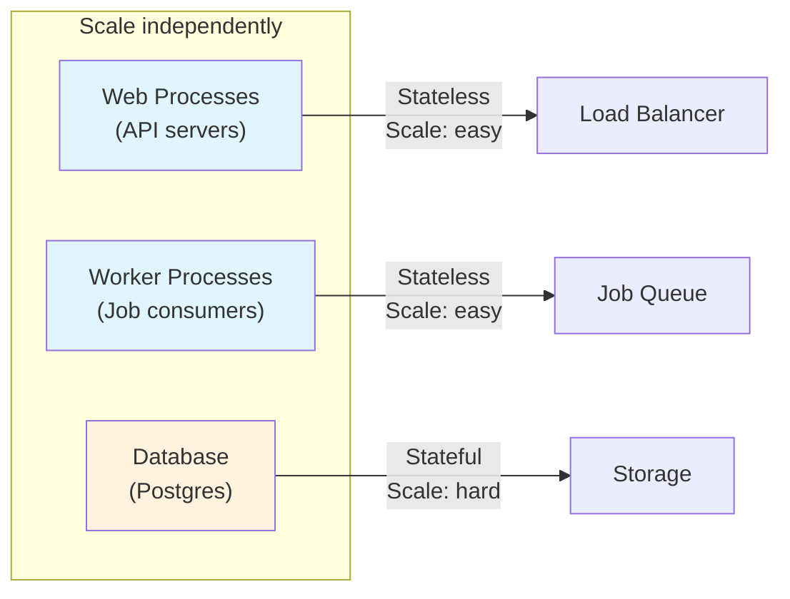
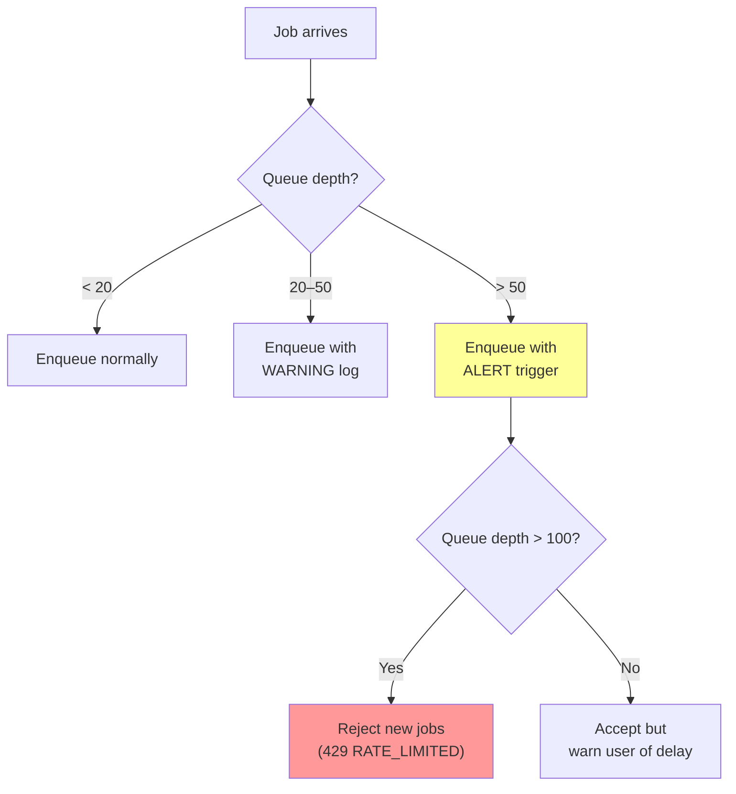
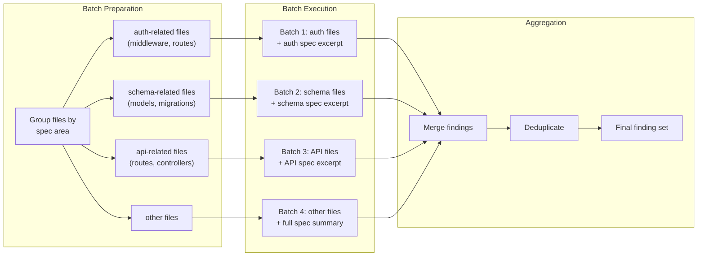
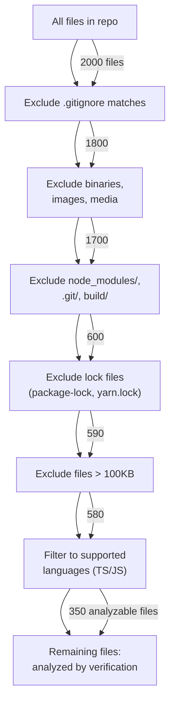

# Document 18: Scalability & Performance Strategy

## 1. Purpose and Scope

Document 5 set the performance targets: PRD generation under 30 seconds (p95), full pipeline under 5 minutes, Tier 1 verification under 60 seconds for ~500 files, Tier 2 under 3 minutes, and the system must handle 100 concurrent verification runs without degradation. Document 17 deployed the system on Railway with a single web process, a single worker, and a managed Postgres instance. This document bridges the gap between those targets and that deployment: what are the actual bottlenecks, when does the single-instance architecture stop being sufficient, and how does the system scale when it does.

The core insight governing this entire document: **Verity's bottleneck is not compute, network, or database — it is the LLM API.** Every generation call and every semantic verification call waits on a network round-trip to the Claude API that takes 5–30 seconds regardless of how fast the local infrastructure is. This means traditional web-application scaling strategies (more CPU, more instances, database read replicas) solve secondary problems. The primary scaling strategy is: minimize the number and size of LLM calls, and maximize the useful work done per call.

### What this document resolves

| Open question | Source | Resolution section |
|---|---|---|
| Job queue technology: pg-boss vs. BullMQ | Document 17 §21 | §6.1 |
| Rate limiter storage backend | Document 16 §21, Document 17 §21 | §9.4 |
| Whether diff endpoint should pre-compute or compute on-demand | Document 14 §18 | §9.3 |
| Tier 2 semantic checks: one batched call vs. several smaller calls | Document 11 §10 | §8.2 |
| Monitoring/alerting thresholds for cost safeguards | Document 16 §21 | §12.5 |

### What this document does not define

- Sprint-level implementation order for scaling features — Document 19 (Development Roadmap).
- AI prompt design or model selection — Document 13 (AI Architecture).
- Specific hosting provider migration mechanics — addressed at the architecture level here; deployment specifics in Document 17.

---

## 2. Scalability Principles

1. **Scale the bottleneck, not the stack.** The LLM API is the bottleneck for response time. The database is the bottleneck for concurrent operations. Adding more application servers without addressing these two constraints wastes money. Every scaling decision in this document is justified by identifying which bottleneck it alleviates.

2. **Predictable cost over maximum throughput.** Document 5 §9 requires bounded, predictable LLM costs. A scaling strategy that increases throughput by making more LLM calls is not scaling — it's spending. Every throughput improvement must either reduce per-unit LLM cost or increase throughput without additional LLM calls.

3. **Scale incrementally.** Document 17 Principle 2: simple until proven insufficient. This document defines scaling *thresholds* — "when metric X exceeds Y, apply intervention Z" — not a pre-built architecture running at maximum scale from day one. Every scaling intervention has a trigger condition.

4. **Measure before optimizing.** No caching layer, no read replica, no connection pooler is added until production metrics confirm the bottleneck it addresses is real. Premature optimization in infrastructure is more expensive than in code — it adds ongoing operational cost, not just development time.

5. **Degrade gracefully under load.** When the system reaches capacity, individual requests should get slower (bounded queue wait time), not fail. Queue-based architecture (Document 11 §4) provides this naturally: a spike in generation requests deepens the queue rather than crashing the server.

---

## 3. Horizontal Scaling

### 3.1 Scaling units

Verity has three independently scalable units:



| Unit | Scaling difficulty | Trigger | Method |
|---|---|---|---|
| **Web processes** | Easy — stateless (sessions in Postgres, Document 16 §6) | API response latency > 500ms p95 under normal load (excluding LLM-bound requests) | Add Railway instances; built-in load balancing |
| **Worker processes** | Easy — stateless (job state in queue + Postgres) | Queue depth consistently > 20 for > 5 minutes | Add Railway worker instances; queue library handles multi-consumer |
| **Database** | Hard — stateful, single-writer | Connection pool exhaustion or query latency > 100ms p95 | Connection pooler first, then vertical scaling, then read replicas (§5) |

### 3.2 v1 capacity assessment

Before scaling, the question is: how much load can the v1 single-instance architecture handle?

**Web process (API):**

A single Node.js process on a 512MB Railway container handles ~200–500 concurrent connections comfortably for an API that primarily reads from Postgres and enqueues jobs. Document 5 §2's target of 100 concurrent users (not the same as 100 concurrent verification *runs* — those are worker-side) is well within this capacity.

Calculation: the average API request (GET endpoint, no LLM call) completes in ~10–50ms. At 500ms budget, a single process handles ~20–100 requests/second. Even pessimistically, 100 concurrent users making 1 request/second each requires 100 req/s — within reach of a single process.

**Worker process (jobs):**

A single worker running 5 concurrent jobs (Document 17 §8.2) can process:
- Generation runs: ~5 concurrent, each taking 10–30 seconds = ~10–30 runs/minute throughput.
- Verification runs: ~5 concurrent, each taking 1–4 minutes = ~1–5 runs/minute throughput.

For 100 concurrent verification runs (Document 5 §2): a single worker with 5 concurrent jobs would clear a 100-job queue in ~20–100 minutes. This does not meet the "without degradation" requirement if users expect their verification to start immediately. The practical interpretation: 100 concurrent runs should *complete* within a reasonable time (< 30 minutes for the full queue), which requires multiple workers.

**Scaling plan for 100 concurrent runs:**

| Workers | Concurrency per worker | Total concurrent jobs | Queue clearance time (100 runs) |
|---|---|---|---|
| 1 | 5 | 5 | ~80 min (too slow) |
| 4 | 5 | 20 | ~20 min (acceptable) |
| 10 | 5 | 50 | ~8 min (good) |
| 20 | 5 | 100 | ~4 min (target) |

**The constraint is not the workers — it's the LLM API rate limit.** 20 workers making concurrent Claude API calls would hit Anthropic's per-key rate limits long before the workers themselves are saturated. This is why Principle 1 matters: scaling workers beyond what the LLM API can sustain wastes money.

### 3.3 When to scale

| Trigger metric | Threshold | Scaling action |
|---|---|---|
| Average queue wait time (time from enqueue to job start) | > 2 minutes | Add 1 worker instance |
| Web process CPU > 70% sustained | > 5 minutes | Add 1 web instance |
| Web process memory > 80% sustained | > 5 minutes | Increase container RAM (vertical first), then add instance |
| Queue depth > 50 jobs | > 10 minutes sustained | Add 2 worker instances (queue spikes need faster response than gradual growth) |

---

## 4. Vertical Scaling

### 4.1 When vertical beats horizontal

For a solo developer on Railway, vertical scaling (bigger container) is operationally simpler than horizontal scaling (more containers) and should be the first response to resource pressure:

| v1 (current) | v2 (vertical) | v3 (horizontal) |
|---|---|---|
| 512MB RAM, 0.5 CPU | 1GB RAM, 1 CPU | 2× 512MB RAM instances |
| ~$5/service/month | ~$10/service/month | ~$10/service/month (same cost) |
| 1 process | 1 process (faster) | 2 processes (more complex) |

**Decision rule:** scale vertically until the container reaches 2GB RAM / 2 CPU. Beyond that, horizontal scaling is more cost-effective (two 1GB containers cost less than one 4GB container on most platforms and provide redundancy).

### 4.2 Node.js specific considerations

- **Heap memory:** Node.js defaults to ~1.5GB max heap on 64-bit systems. For a 512MB container, set `--max-old-space-size=384` to leave room for the OS and native allocations. Scale this with the container.
- **Event loop utilization:** monitor with `perf_hooks.monitorEventLoopDelay()`. If p99 event loop delay exceeds 100ms, the process is compute-bound — scale up CPU or investigate the hot path (likely AST parsing for large repos, §13).
- **tree-sitter memory:** AST parsing of large files can spike memory usage. The 100KB per-file limit (Document 16 §11.1) bounds this, but a repo with many files at the limit can still consume significant memory. Monitor per-verification-run peak memory.

---

## 5. Database Scaling

### 5.1 Bottleneck analysis

The database serves three workloads with different scaling characteristics:

| Workload | Pattern | Scaling concern |
|---|---|---|
| **OLTP (API reads/writes)** | Short queries: project lookups, spec version retrieval, finding queries | Connection count; query latency |
| **Job queue operations** | Frequent polls: pg-boss polling for available jobs; status updates | Polling frequency; lock contention |
| **Analytical queries** | Finding aggregations (grouped counts, severity distributions), version diffs | Query complexity; table scan on large finding sets |

### 5.2 Connection pool scaling

Document 17 §6.2 configured 20 connections (10 per process). When scaling horizontally:

| Instance count | Connections needed | Available (Railway default ~100) | Action needed? |
|---|---|---|---|
| 1 web + 1 worker | 20 | ✅ | No |
| 2 web + 4 workers | 60 | ✅ | No |
| 4 web + 10 workers | 140 | ❌ Exceeds limit | Yes — add PgBouncer |

**PgBouncer deployment:** when connection count approaches the database's limit, deploy PgBouncer as a Railway service between the application and Postgres. PgBouncer multiplexes ~200 application connections onto ~30 database connections using transaction-mode pooling. Cost: ~$5/month for a small Railway instance.

### 5.3 Query performance optimization

**Indexes for the critical query paths:**

| Query | Table(s) | Index | Rationale |
|---|---|---|---|
| Findings by run + severity filter | `findings` | `(verification_run_id, severity)` | Findings Dashboard (Document 14 §11) filters by severity; this index supports the most common access pattern |
| Findings by run + spec_area filter | `findings` | `(verification_run_id, spec_area)` | Second-most-common filter on Findings Dashboard |
| SpecVersions by project + version number | `spec_versions` | `(project_id, version_number DESC)` | Version history (Document 14 §9) retrieves versions in reverse chronological order |
| Projects by workspace + updated_at | `projects` | `(workspace_id, updated_at DESC)` | Projects List (Document 14 §5) sorted by most recently updated |
| Jobs by status | `pg-boss jobs table` | Managed by pg-boss | Job queue polling — pg-boss manages its own indexes |

These indexes are created in the initial migration, not added retroactively. The cost (slightly slower writes, minor storage) is negligible for the write volumes Verity will see.

### 5.4 Read replicas (future)

Not needed until the database is CPU-bound or read latency degrades despite indexing. When needed:

- Railway supports read replicas on higher-tier plans.
- The application's data-access layer routes read-only queries (GET endpoints, finding aggregations) to the replica and write queries to the primary.
- Trade-off: replication lag (typically < 100ms) means a user might not immediately see a just-created SpecVersion on a read-replica-backed endpoint. Mitigation: route the authenticated user's own data reads to the primary for consistency; route analytical/aggregation queries to the replica.

### 5.5 Table partitioning (future)

If the `findings` table grows beyond millions of rows (hundreds of projects × hundreds of verification runs × dozens of findings each):

- Partition by `verification_run_id` or by `project_id` — most queries are scoped to a single run or project.
- Partitioning improves query performance (smaller index scans) and enables partition-level archival (old runs can be moved to cold storage).
- Not needed at v1 scale. The threshold: when a `SELECT` on `findings` with an indexed filter takes > 50ms, evaluate partitioning.

---

## 6. Queue Scaling

### 6.1 Technology decision: pg-boss for v1 (resolves Document 17 §21)

**Decision: pg-boss (Postgres-backed queue).**

| Criterion | pg-boss | BullMQ (Redis) |
|---|---|---|
| **Additional infrastructure** | None — uses existing Postgres | Requires Redis instance (~$5–10/month) |
| **Multi-consumer support** | ✅ Built-in via advisory locks | ✅ Native |
| **Throughput** | ~100–500 jobs/second | ~10,000+ jobs/second |
| **Delayed/scheduled jobs** | ✅ | ✅ |
| **Priority queues** | ✅ | ✅ |
| **Retry with backoff** | ✅ | ✅ |
| **Monitoring/visibility** | SQL queries on job tables | Redis Insight / Bull Board |
| **Operational complexity** | Low — it's just Postgres | Medium — another service to monitor, secure, back up |

**Rationale:** Verity's job throughput at v1 is ~10–50 jobs/hour (a solo developer running a few generation/verification cycles per session). pg-boss handles 100–500 jobs/second — three orders of magnitude more than needed. Adding Redis for queue performance would be premature optimization with ongoing operational cost.

**Migration trigger to BullMQ:** when any of these occur:
- pg-boss polling queries add measurable load to Postgres (visible in slow query logs or increased database CPU).
- Job throughput requirements exceed 100 jobs/second sustained (would indicate hundreds of concurrent users, far beyond v1's scope).
- Features requiring Redis anyway are added (real-time push via pub/sub, session store migration, caching layer).

At that point, BullMQ is a direct replacement — the job interface is abstracted behind Document 11 §3's module boundaries; the queue consumer and producer code change implementations, not interfaces.

### 6.2 Queue configuration

```typescript
// pg-boss configuration
const boss = new PgBoss({
  connectionString: process.env.DATABASE_URL,
  
  // Job retention: completed jobs cleaned up after 7 days
  archiveCompletedAfterSeconds: 60 * 60 * 24 * 7,
  
  // Failed job retention: kept for 30 days (for debugging)
  archiveFailedAfterSeconds: 60 * 60 * 24 * 30,
  
  // Monitoring interval: how often pg-boss checks for stale jobs
  monitorStateIntervalSeconds: 30,
  
  // Delete archived jobs older than 30 days
  deleteAfterSeconds: 60 * 60 * 24 * 30,
});
```

### 6.3 Queue priorities

Not all jobs are equal. Generation takes precedence over verification (the user is waiting for their spec to be built), and single-artifact generation takes precedence over full-pipeline generation (shorter wait = better perceived performance):

| Queue name | Priority | Concurrency | Typical duration |
|---|---|---|---|
| `generation-single` | High | 3 | 10–30 seconds |
| `generation-pipeline` | Medium | 2 | 2–5 minutes |
| `verification` | Normal | 3 | 1–4 minutes |

Concurrency limits are per worker. With one worker, 8 total concurrent job slots are used (~3+2+3). This allocation ensures that a burst of verification requests doesn't starve generation requests (which have a more immediate user-waiting-for-result expectation).

### 6.4 Queue depth management



**Queue depth > 100 (rejection):** this is the circuit breaker. If 100 jobs are already queued, accepting more would push wait times beyond what any user would tolerate (100 jobs × 1–4 minutes each ÷ 5 concurrent slots = 20–80 minutes). Better to tell the user "the system is busy, try again in a few minutes" than to accept the job and have them wait an hour.

---

## 7. AI Pipeline Scaling

### 7.1 The real bottleneck: LLM API throughput

The Claude API enforces rate limits per API key:

| Limit type | Typical limit (Tier 1–2) | Impact on Verity |
|---|---|---|
| Requests per minute (RPM) | 50–1000 | Generation: 1 request per artifact × 7 artifacts = 7 requests per full pipeline. 50 RPM supports ~7 concurrent pipelines |
| Tokens per minute (TPM) | 40K–400K | Each generation call uses ~2K–8K tokens. 40K TPM supports ~5–20 concurrent calls |
| Tokens per day | 1M–10M | Bounds daily throughput; 1M tokens/day ≈ 125–500 generation runs |

**Consequence:** scaling workers beyond what the LLM API can sustain is pointless. 20 workers making 5 concurrent calls each = 100 concurrent LLM requests, which would be rate-limited to ~50 RPM regardless. The scaling ceiling is not Verity's infrastructure — it's Anthropic's API tier.

### 7.2 Strategies to maximize throughput within API limits

| Strategy | How it works | Throughput gain | Cost impact |
|---|---|---|---|
| **Request batching** | Combine multiple small prompts into one large prompt where possible | ~2–3× fewer requests | Neutral (same tokens, fewer requests) |
| **Prompt caching** (Anthropic feature) | Cache the system prompt + artifact context prefix across calls | ~30% token reduction on cached portion | ~30% cost reduction |
| **Tiered model routing** | Use Haiku for simple tasks (roadmap, task decomposition); Sonnet for complex tasks (architecture, verification) | 2–3× more requests within TPM budget | ~50% cost reduction on routed tasks |
| **Parallel pipeline stages** | Run independent stages concurrently (if any exist — currently stages are sequential by design) | Not applicable: each stage depends on the previous | N/A |

### 7.3 Prompt caching implementation

Anthropic's prompt caching allows marking portions of a prompt as cacheable. For Verity, the system prompt and schema instructions are identical across calls of the same type:

```
┌─────────────────────────────────────────┐
│ CACHEABLE (identical across calls)       │
│                                          │
│ System prompt: "You are a senior..."     │
│ Schema instructions: "Output JSON..."   │
│ Output format: { ... Zod schema ... }   │
│                                          │
├─────────────────────────────────────────┤
│ NOT CACHEABLE (varies per call)          │
│                                          │
│ User's idea text / upstream artifacts   │
│ Repository code (verification)          │
└─────────────────────────────────────────┘
```

Estimated savings: the system prompt + schema instructions are ~1,000–2,000 tokens. At 5 calls per generation pipeline × 100 pipelines/day = 500 calls/day. Caching saves ~500K–1M tokens/day at the cached-token discount rate (typically 90% cheaper than input tokens). This translates to ~$1–5/day savings at Sonnet pricing.

---

## 8. Verification Scaling

### 8.1 Tier 1 (deterministic) scaling

Tier 1 is CPU-bound (tree-sitter AST parsing, regex matching, schema comparison). It does not make LLM calls. Scaling strategies:

| Strategy | Complexity | Impact |
|---|---|---|
| **Parallelize file parsing** | Low — use Node.js worker_threads or process.fork per file batch | ~3–5× speedup on multi-core containers |
| **Cache parsed ASTs** | Medium — cache the AST of each file keyed by content hash | Eliminates re-parsing for unchanged files across verification runs |
| **Skip unchanged files** | Medium — diff against previous run's file hashes; only re-parse changed files | Proportional to change size, not repo size; huge win for re-verification (Document 7 Journey 2) |

**Skip unchanged files** is the highest-leverage optimization for the return-loop use case (Document 7 Journey 2): Priya changes one file, re-verifies, and should see results faster than the first full verification. If 490 of 500 files are unchanged, Tier 1 only needs to re-analyze 10 files instead of 500.

**Implementation:** each verification run stores the SHA-256 hash of every analyzed file. On the next run for the same project, the Repo Service computes hashes for the newly ingested files, compares against the stored hashes, and passes only changed files to the deterministic verifier. Unchanged-file findings from the previous run are carried forward.

**Performance target:** Tier 1 on 500 files (full analysis) < 60 seconds (Document 5 §1). Tier 1 on 10 changed files (incremental) < 5 seconds.

### 8.2 Tier 2 (semantic) scaling — batching strategy (resolves Document 11 §10)

**Decision: several smaller batched calls with intermediate checkpointing, not one large call.**

| Approach | Pros | Cons |
|---|---|---|
| One large call (all files + spec in one prompt) | Single round-trip; holistic cross-file reasoning | Exceeds context window for large repos; entire run fails on timeout; no partial results; no progress indication |
| **Several smaller batched calls** (files grouped by spec area, 5–15 files per batch) | Fits in context window; partial results on failure; progress indication per batch; parallelizable across batches | Multiple round-trips; may miss cross-batch dependencies; higher total token count due to repeated spec context |

**Rationale:** the one-large-call approach fails at the constraint that matters most — context window limits. A 500-file repo at ~50 lines/file is ~25,000 lines of code. At ~4 tokens/line, that's ~100K tokens of code alone, plus the spec context (~5K–10K tokens). This exceeds current model context windows (200K for Claude Sonnet) when combined with the system prompt and output schema. Even if it fit, a single 200K-token prompt with a 3-minute timeout is fragile — a single network hiccup loses the entire run.

**Batching implementation:**



**File grouping heuristic:**
- Files in `middleware/`, `auth/`, or containing auth-related imports → auth batch (checked against API endpoint auth requirements).
- Files in `models/`, `entities/`, `schema/`, or containing ORM imports → schema batch (checked against SchemaArtifact).
- Files in `routes/`, `controllers/`, `api/`, or containing route definitions → API batch (checked against APIArtifact endpoint list).
- Remaining files → general batch (checked against architecture components).

**Per-batch prompt structure:**
```
System prompt (cacheable, ~1,500 tokens)
Spec excerpt for this batch (~1,000–3,000 tokens)
Files in this batch (~5,000–20,000 tokens per batch of 5–15 files)
Instructions: "Analyze these files against the spec excerpt. Report findings."
```

Total per batch: ~8K–25K tokens — well within context limits with room for the model's response.

**Parallelization:** batches within a verification run can execute in parallel (they analyze different files against different spec sections). With 4 batches executing in parallel, Tier 2 total time ≈ single-batch time (longest batch) rather than sum-of-all-batches time. The LLM API rate limit (§7.1) is the constraint: 4 parallel calls consume 4 RPM from the budget.

**Intermediate checkpointing:** each batch's findings are persisted to the database as they complete. If the worker crashes mid-run (between batch 2 and batch 3), the run can be resumed from batch 3 rather than restarted from scratch. This is particularly valuable for large repos where a full re-run costs several dollars in LLM calls.

### 8.3 Verification result caching

Verification results for a specific (specVersionId, commitSha) pair are deterministic — running the same spec against the same code should produce the same findings. Caching opportunity:

- If a user triggers verification and nothing has changed (same spec version, same commit), return the cached results immediately without re-running.
- **Implementation:** before enqueueing a verification job, check if a completed VerificationRun exists with the same `spec_version_id` and `commit_sha`. If yes, return its findings directly. If no, enqueue the job.
- **Cache invalidation:** none needed — the cache key includes both the spec version (immutable, Document 10 Design Principle 2) and the commit SHA (immutable by definition). If either changes, it's a cache miss.

This optimization costs nothing to implement and eliminates the most expensive redundant operation in the system.

---

## 9. Caching Strategy

### 9.1 Caching philosophy

Verity's data model is designed around immutability (Document 10 Design Principle 2): SpecVersions are never updated, VerificationRuns are never modified after completion, and Findings are append-only per run. This is unusually cache-friendly — immutable data never needs cache invalidation (the most complex and error-prone aspect of caching). The caching strategy exploits this aggressively.

### 9.2 Cache layers

| Layer | What's cached | Cache location | TTL | Invalidation |
|---|---|---|---|---|
| **CDN** | Static assets (JS, CSS, images) | Cloudflare edge (Document 17 §10) | 1 year (content-hash in filename) | Deploy-time: new filename = automatic cache miss |
| **API response** | SpecVersion artifact content (immutable) | Application memory (LRU) | 1 hour | None needed — immutable data. Memory pressure evicts LRU entries |
| **Database query** | Finding aggregations (grouped counts by severity/spec_area) | Application memory (computed on first request, stored per runId) | Until process restart | None needed — aggregation over immutable findings for a completed run is deterministic |
| **LLM prompt prefix** | System prompt + schema instructions | Anthropic's prompt cache (§7.3) | Per Anthropic's cache TTL (typically ~5 minutes) | Automatic — cache key includes prompt hash |
| **File hashes** | Per-file SHA-256 hashes from last verification run | Database (VerificationRun metadata) | Permanent per run | None — used for incremental verification (§8.1) |

### 9.3 Diff computation caching (resolves Document 14 §18)

**Decision: compute on-demand, cache the result.**

| Approach | Computation cost | Storage cost | Latency |
|---|---|---|---|
| Pre-compute at SpecVersion creation | Higher upfront (diff every version against its predecessor at creation time, even if never viewed) | Higher (stored for every version pair) | Zero on read |
| **Compute on-demand, cache** | Zero upfront; computed only when user views the diff | Lower (stored only for diffs actually viewed) | First request: ~50–200ms; subsequent: cached |
| Compute on-demand, no cache | Zero upfront | Zero | Every request: ~50–200ms |

**Rationale:** most SpecVersions are never diffed — the user views the current version, not the history. Pre-computing diffs for every version is wasted work. On-demand computation with caching gives zero-cost for unviewed versions and fast response for viewed versions. The diff between two immutable SpecVersions is itself immutable — once computed and cached, it never needs recomputation.

**Cache implementation:** store the computed diff as a JSONB column on a `spec_version_diffs` table (lazy-populated). When `GET /api/projects/:id/versions/:num/diff` is called (Document 14 §9), check the table first; if no row exists, compute the diff, store it, and return it.

### 9.4 Rate limiter storage (resolves Document 16 §21, Document 17 §21)

**Decision: Postgres-backed rate limiting for v1; Redis-backed when Redis is added for other reasons.**

| Option | Pros | Cons |
|---|---|---|
| In-memory | Fastest; simplest | Lost on restart; doesn't work across multiple web instances |
| **Postgres-backed** | Persistent across restarts; works across instances; no additional service | Slightly slower (~5ms per check); adds load to database |
| Redis-backed | Fast; persistent; works across instances | Requires Redis service (not in v1 stack) |

**Rationale:** in-memory rate limiting fails the moment a second web instance is added (a user could double their rate limit by hitting different instances). Postgres-backed rate limiting works correctly from day one, including across scaling events. The ~5ms per-check latency is negligible compared to the API request's total latency.

**Implementation:** a `rate_limits` table with `(user_id, endpoint_tier, window_start, request_count)`. On each request, an `INSERT ... ON CONFLICT UPDATE` increments the count. If the count exceeds the tier's limit (Document 14 §13), the request is rejected with `429`.

**Migration to Redis:** when Redis is added (for BullMQ or caching), rate limiting migrates to Redis's `INCR` + `EXPIRE` pattern — faster (~1ms vs. ~5ms) and eliminates the database load. This is a straightforward swap within the rate-limiting middleware; no API changes needed.

---

## 10. Performance Optimization

### 10.1 API response latency targets

| Endpoint category | Target (p95) | Current bottleneck | Optimization |
|---|---|---|---|
| Read endpoints (GET) | < 100ms | Database query time | Indexes (§5.3); response caching for immutable data (§9.2) |
| Write endpoints (POST/PUT/PATCH) | < 200ms | Database write + validation | Minimal — writes are fast at this scale |
| Job trigger endpoints | < 100ms (enqueue time only) | Queue insertion | pg-boss enqueue is ~5–10ms |
| Job poll endpoint (GET /api/jobs/:id) | < 50ms | Single-row lookup | Primary key lookup; near-instant |
| Findings list (paginated) | < 200ms | Complex query with filters + aggregation | Composite indexes (§5.3); pre-computed grouped counts per run (§9.2) |
| Version diff | < 300ms (first request) / < 50ms (cached) | Diff computation | On-demand caching (§9.3) |

### 10.2 Frontend performance targets

| Metric | Target | Optimization |
|---|---|---|
| Largest Contentful Paint (LCP) | < 1.5s | Static assets on CDN; code splitting; lazy-loaded routes |
| First Input Delay (FID) | < 100ms | Minimal main-thread JavaScript; defer non-critical hydration |
| Cumulative Layout Shift (CLS) | < 0.1 | Skeleton loaders with fixed dimensions (Document 12 §7) |
| Time to Interactive (TTI) | < 2.0s | Bundle size < 200KB gzipped; tree-shaking; no unused dependencies |

### 10.3 Database query performance

**Slow query monitoring:** any query taking > 100ms is logged (structured logging, Document 5 §7). Persistent slow queries trigger index review.

**N+1 query prevention:** the API layer uses eager loading (JOIN-based) for related entities. For example, the Project Dashboard endpoint (Document 14 §5) fetches the project, its current spec version summary, repo connection, and verification summary in a single query with JOINs — not 4 separate queries.

**Connection pool tuning:** monitor pool wait time. If requests frequently wait > 10ms for a connection, increase the pool size (Document 17 §6.2) or add PgBouncer (§5.2).

---

## 11. Context Window Optimization

### 11.1 The constraint

Every LLM call must fit within the model's context window: system prompt + input context + model response. For Claude Sonnet (200K context window), the practical budget is:

| Component | Token budget | Notes |
|---|---|---|
| System prompt + schema instructions | ~2,000 | Relatively fixed across calls |
| Artifact context (upstream specs) | ~3,000–10,000 | Grows as more artifacts exist |
| User input / repo code | ~10,000–50,000 | The largest variable |
| Reserved for response | ~4,000–8,000 | Model's output tokens |
| **Total budget** | ~19,000–70,000 | Well within 200K, but larger repos push toward the limit |

### 11.2 Context reduction strategies

| Strategy | How it works | Token savings | Trade-off |
|---|---|---|---|
| **Artifact summarization** | Instead of including the full PRD (potentially thousands of tokens) as context for Schema generation, include a structured summary | ~50–70% reduction in artifact context | Summary may omit details needed for high-quality generation |
| **Selective context inclusion** | For API generation, include the full Schema (needed) but only the Architecture summary (not every detail) | ~30–50% reduction | Requires knowing which upstream artifacts are most relevant per generation stage |
| **File filtering for verification** | Only include files relevant to the current verification batch (§8.2), not the entire repo | ~80–90% reduction vs. full repo | May miss cross-file dependencies (mitigated by the batching strategy) |
| **Code truncation** | For very large files, include only the first 100KB (Document 16 §11.1) and the sections around route/model definitions | ~50–80% reduction for large files | May miss deeply nested issues |
| **Previous-version diffing** | For regeneration, include only the diff from the previous version rather than the full upstream artifact | ~70–90% reduction for small edits | Only applicable for regeneration, not initial generation |

### 11.3 Context budget allocation per stage

| Generation stage | Upstream context (tokens) | User input (tokens) | Response budget (tokens) | Total |
|---|---|---|---|---|
| PRD | 1,500 (system) | 500–5,000 (idea text) | 4,000 | ~6K–11K |
| Architecture | 1,500 + 3,000 (PRD) | — | 6,000 | ~11K |
| Schema | 1,500 + 2,000 (PRD summary) + 3,000 (Architecture) | — | 4,000 | ~11K |
| API | 1,500 + 2,000 (PRD summary) + 2,000 (Arch summary) + 3,000 (Schema) | — | 6,000 | ~15K |
| Repo Structure | 1,500 + 2,000 (Arch summary) + 2,000 (Schema summary) + 3,000 (API) | — | 4,000 | ~13K |
| Roadmap | 1,500 + 2,000 (PRD summary) + 2,000 (Arch summary) | — | 4,000 | ~10K |
| Tasks | 1,500 + 2,000 (PRD summary) + 2,000 (Arch summary) + 2,000 (Roadmap) | — | 6,000 | ~14K |

**Key observation:** the context budget grows modestly across stages because each stage includes *summaries* of earlier artifacts, not full artifacts. The full artifact is only included when the stage directly needs it (e.g., Schema generation includes the full Architecture because it derives components from it). This is the "context minimization" principle from Document 5 §9 made concrete.

---

## 12. Token Cost Optimization

### 12.1 Cost model

| Model | Input token cost | Output token cost | Cached input cost |
|---|---|---|---|
| Claude Sonnet | ~$3/M tokens | ~$15/M tokens | ~$0.30/M tokens |
| Claude Haiku | ~$0.25/M tokens | ~$1.25/M tokens | ~$0.025/M tokens |

### 12.2 Per-operation cost estimate

| Operation | Input tokens | Output tokens | Estimated cost (Sonnet) | Estimated cost (Haiku) |
|---|---|---|---|---|
| Single artifact generation | ~5K–15K | ~3K–6K | ~$0.06–$0.14 | ~$0.005–$0.012 |
| Full pipeline (7 stages) | ~70K–100K | ~25K–40K | ~$0.60–$0.90 | ~$0.05–$0.07 |
| Verification (Tier 2, 4 batches) | ~60K–120K | ~5K–15K | ~$0.25–$0.60 | ~$0.02–$0.04 |
| **Typical session (1 pipeline + 2 verifications)** | | | **~$1.10–$2.10** | **~$0.09–$0.15** |

### 12.3 Cost optimization strategies

| Strategy | Implementation | Monthly savings (est.) | Complexity |
|---|---|---|---|
| **Prompt caching** (§7.3) | Mark system prompts as cacheable | ~30% on cached portions (~$10–30/month) | Low — API flag on prompt segments |
| **Model routing** | Use Haiku for roadmap, task decomposition; Sonnet for architecture, verification | ~40% overall (~$20–50/month) | Medium — routing logic per stage |
| **Incremental verification** (§8.1) | Skip unchanged files in Tier 1; only re-analyze changed batches in Tier 2 | ~50–80% on re-verification runs | Medium — file hash tracking |
| **Verification result caching** (§8.3) | Return cached results for identical (specVersion, commitSha) | 100% for duplicate runs | Low — DB lookup before enqueue |
| **Context minimization** (§11.2) | Summaries instead of full artifacts | ~30–50% on input tokens | Medium — summary generation |

### 12.4 Cost ceiling enforcement

Per Document 5 §9 and Document 16 §14.4:

| Limit | Scope | Value | Action on breach |
|---|---|---|---|
| Per-run cost cap | Single generation or verification run | $2.00 | Abort run with `GENERATION_FAILED`; log as cost-breach event |
| Per-user daily cap | All runs by a single user in 24 hours | $20.00 | Reject new runs with `RATE_LIMITED`; action: `contact_support` |
| System hourly cap | All runs across all users in 1 hour | $50.00 | Reject all new runs; P1 alert to operator |
| System monthly cap | All LLM spend in a calendar month | $500.00 | Reject all new runs; P0 alert to operator |

### 12.5 Cost monitoring thresholds (resolves Document 16 §21)

| Alert | Threshold | Channel |
|---|---|---|
| Hourly LLM spend anomaly | > $10/hour (5× expected average of ~$2/hour) | Sentry → Email |
| Daily LLM spend anomaly | > $50/day (2.5× expected average of ~$20/day at moderate usage) | Email |
| Monthly approaching cap | > $400 (80% of $500 monthly cap) | Email + SMS |
| Single run exceeding per-run cap | > $2.00 | Logged; run aborted |

---

## 13. Large Repository Handling

### 13.1 Scale targets

Document 5 §1 targets ~500 files. But "500 files" doesn't capture the full range:

| Repo profile | Files | Total size | Token estimate | Challenge |
|---|---|---|---|---|
| Small (typical) | < 100 | < 2MB | < 30K | No challenge; everything fits in memory and context window |
| Medium (target) | 100–500 | 2–20MB | 30K–150K | Batching needed for Tier 2; incremental verification valuable |
| Large (stretch) | 500–2000 | 20–100MB | 150K–500K | Must filter aggressively; only analyze relevant files |
| Very large (out of scope) | > 2000 | > 100MB | > 500K | Beyond v1 scope; monorepo support is a future feature |

### 13.2 File filtering pipeline



A 2,000-file repo typically yields ~300–500 analyzable files after filtering. This is within the "medium" profile above.

### 13.3 Memory management for large repos

The worker process has limited memory (512MB–1GB, Document 17 §4). For large repos:

- **Streaming ingestion:** files are fetched from GitHub and written to disk (Document 17 §7.3) one at a time, not loaded entirely into memory.
- **Sequential AST parsing:** tree-sitter parses one file at a time; the AST is discarded after analysis (not held in memory for the entire run).
- **Batch-level memory ceiling:** each verification batch loads only its files (~5–15 files × ~50KB = ~250KB–750KB). Memory usage stays bounded regardless of total repo size.

### 13.4 Timeout management

| Phase | Timeout | Behavior on timeout |
|---|---|---|
| GitHub repo ingestion | 5 minutes | Abort ingestion; mark run as `VERIFICATION_FAILED` with `details.phase: "ingestion"` |
| Tier 1 full analysis | 2 minutes (soft), 5 minutes (hard) | Soft: log warning; Hard: abort with partial results |
| Tier 2 per-batch LLM call | 2 minutes per batch | Retry once; if still times out, mark batch as failed; other batches continue |
| Tier 2 total | 10 minutes | Abort remaining batches; persist findings from completed batches; mark run as `partial` |

**Partial results:** a verification run that completes some batches but fails on others is more useful than no results at all. The run is marked with a status that indicates partial completion, and the Findings Dashboard (Document 12 §6.10) shows a banner: "Verification partially completed — some files could not be analyzed."

---

## 14. Multi-Tenant Scaling

### 14.1 Current model (v1)

v1's multi-tenancy is simple: every user has one workspace (Document 4 §4), and workspace isolation is enforced at the data-access layer (Document 16 §5.2). There is no resource isolation between tenants at the infrastructure level — all users share the same web process, worker process, and database.

### 14.2 Noisy neighbor mitigation

Without infrastructure-level isolation, one user's heavy workload can affect others:

| Scenario | Impact | Mitigation |
|---|---|---|
| User A triggers 20 generation runs | Queue fills up; User B's run waits | Per-user concurrent job limit: max 3 active jobs per user. User A's 4th run is rejected with `RATE_LIMITED` until one completes |
| User A's large repo verification takes 10 minutes | Worker slot occupied | Verification timeout (§13.4); worker concurrency means other slots remain available |
| User A makes 200 API requests/second | Web process saturated | Rate limiting (Document 14 §13); per-user limits, not per-IP |

### 14.3 Scaling from single-tenant to multi-tenant at scale

| Scale | Users | Infrastructure | Isolation |
|---|---|---|---|
| Portfolio (v1) | 1–10 | 1 web + 1 worker + 1 Postgres | Application-level (workspace_id) |
| Early growth | 10–100 | 2 web + 4 workers + 1 Postgres + PgBouncer | Application-level + per-user job limits |
| Growth | 100–1,000 | 4 web + 10 workers + Postgres + Redis + PgBouncer | Application-level + queue-level fair scheduling |
| Scale (Document 19 Later) | 1,000+ | Kubernetes + dedicated worker pools + read replicas | Queue-level isolation; potentially per-tenant worker allocation |

---

## 15. Capacity Planning

### 15.1 Capacity model

```
Users = 100 (target growth scenario)
Sessions per user per week = 3 (Document 7 Journey 2)
Generation runs per session = 2
Verification runs per session = 3
Total runs per week = 100 × 3 × 5 = 1,500 runs/week ≈ 215 runs/day ≈ 27 runs/hour (average)
Peak: 3× average = ~80 runs/hour

LLM calls per run:
  Generation: ~3 calls average (mix of single-artifact and pipeline)
  Verification: ~5 calls average (1 Tier-1-only + 4 Tier-2 batches)
  Average: ~4 calls/run

LLM calls per hour (peak): 80 × 4 = 320 calls/hour ≈ ~5.3 calls/minute

Anthropic API limits (Tier 2): ~1,000 RPM → 320 calls/hour is well within limits
```

### 15.2 Resource requirements at scale

| Scale | Web instances | Worker instances | Database | Monthly LLM cost | Monthly infra cost |
|---|---|---|---|---|---|
| 10 users | 1 | 1 | 1GB | ~$50 | ~$25 |
| 100 users | 2 | 4 | 5GB + PgBouncer | ~$500 | ~$80 |
| 500 users | 4 | 10 | 20GB + read replica | ~$2,500 | ~$250 |
| 1,000 users | 8 | 20 | 50GB + read replicas | ~$5,000 | ~$500 |

**Key observation:** at every scale, LLM cost is 5–10× infrastructure cost. The scaling strategy that saves the most money is not "fewer servers" — it's "fewer LLM calls" (incremental verification, result caching, prompt caching, model routing).

### 15.3 Database growth projection

| Entity | Rows per user (annual) | At 100 users | At 1,000 users |
|---|---|---|---|
| Projects | ~5 | 500 | 5,000 |
| SpecVersions | ~50 (10 per project) | 5,000 | 50,000 |
| Artifacts | ~350 (7 per version) | 35,000 | 350,000 |
| VerificationRuns | ~100 (20 per project) | 10,000 | 100,000 |
| Findings | ~2,000 (20 per run) | 200,000 | 2,000,000 |

At 1,000 users, the `findings` table reaches ~2M rows annually. With proper indexing (§5.3), this is well within Postgres's comfortable operating range (Postgres handles billions of rows). Table partitioning (§5.5) becomes worth evaluating at this scale to keep index sizes manageable.

---

## 16. Load Testing Strategy

### 16.1 Test methodology

Load tests validate the capacity model (§15) against real infrastructure. They run against the staging environment (Document 17 §12) with mocked LLM responses (to isolate infrastructure performance from API latency).

### 16.2 Test scenarios

| Scenario | Load profile | Success criteria |
|---|---|---|
| **Baseline** | 10 concurrent users, 1 req/sec each | All responses < 200ms p95; zero errors |
| **Normal load** | 50 concurrent users, 2 req/sec each | API responses < 300ms p95; queue wait < 30s |
| **Peak load** | 100 concurrent users, 3 req/sec each | API responses < 500ms p95; queue wait < 2 min; zero 5xx errors |
| **Stress test** | 200 concurrent users, 5 req/sec each | Graceful degradation: API responds (possibly 429); no crashes; no data corruption |
| **Soak test** | 50 concurrent users for 4 hours | No memory leaks; no connection pool exhaustion; stable response times throughout |

### 16.3 Load test tools

- **API load:** k6 (JavaScript-based, scriptable, produces time-series metrics).
- **Job queue load:** custom script that enqueues N jobs and measures throughput and wait times.
- **Database load:** pgbench for raw database performance; k6 for application-level query performance.

### 16.4 Frequency

- **Before launch:** full load test suite against staging.
- **Before scaling changes:** verify that the change improves the target metric without degrading others.
- **Monthly:** soak test to detect gradual degradation (memory leaks, connection pool drift).

---

## 17. Failure Recovery

### 17.1 Failure modes and recovery

| Failure mode | Detection | Impact | Recovery | Time to recover |
|---|---|---|---|---|
| **Worker crash mid-job** | Job exceeds timeout; health check fails | Job stuck in `running` | pg-boss's expiration mechanism marks stale jobs as failed; worker restarts automatically (Railway) | < 2 minutes |
| **Database connection pool exhaustion** | Connection wait time > 5s; error logs | API returns 500; jobs fail | Automatic: pool recovers as connections are released. Manual: increase pool size or add PgBouncer | < 1 minute (auto) / < 10 minutes (manual) |
| **LLM API outage** | All LLM calls fail with 5xx | Generation and Tier 2 verification fail | Jobs fail after retry; API returns `GENERATION_FAILED`. Manual: wait for provider recovery | Provider-dependent |
| **LLM API rate limiting** | 429 responses from Anthropic | Jobs throttled; queue depth increases | Automatic: exponential backoff with respect to `Retry-After` header. Jobs complete more slowly but don't fail | Self-resolving |
| **GitHub API outage** | Repo ingestion fails | Verification cannot proceed | Job fails with `GITHUB_REPO_INACCESSIBLE`. User retries when GitHub recovers | Provider-dependent |
| **Disk full (ephemeral storage)** | Disk usage alert (Document 17 §18.2) | New ingestions fail | Safety cron (Document 16 §11.3) cleans stale dirs. Manual: increase container disk | < 30 minutes |
| **Memory leak** | Gradual memory increase over hours (soak test detects) | OOM kill; container restart | Automatic: Railway restarts container. Manual: identify and fix the leak | < 1 minute (restart) / days (fix) |

### 17.2 Job idempotency

All jobs are designed to be safely re-runnable (idempotent):

- **Generation jobs:** create a new SpecVersion. Re-running creates another new SpecVersion (slightly wasteful but not harmful — Document 10's immutability means no existing data is corrupted).
- **Verification jobs:** create a new VerificationRun. Re-running creates a duplicate run. The result caching (§8.3) prevents this from making unnecessary LLM calls if the inputs haven't changed.

Idempotency is not a performance optimization — it's a correctness guarantee that makes failure recovery safe. A crashed job can be retried without risk of data corruption or duplicate side effects.

---

## 18. Cost vs. Performance Trade-offs

### 18.1 Decision matrix

| Trade-off | Performance choice | Cost choice | v1 decision | Rationale |
|---|---|---|---|---|
| LLM model for generation | Sonnet (higher quality) | Haiku (cheaper, faster) | **Sonnet** | Generation quality is the product's value proposition; cost of Sonnet generation is ~$0.10/run — acceptable |
| LLM model for verification Tier 2 | Sonnet (more accurate) | Haiku (cheaper) | **Sonnet** | Verification accuracy is the differentiator (Document 3); false positives from a weaker model would erode trust |
| LLM model for roadmap/tasks | Sonnet | Haiku | **Haiku** | Roadmap and task generation are simpler tasks; Haiku produces adequate quality at ~10% of Sonnet's cost |
| Full repo ingestion vs. filtered | Full (more thorough) | Filtered (fewer tokens) | **Filtered** | Unfiltered would 10× token cost with minimal accuracy improvement; most non-source files add noise, not signal |
| Tier 2 batching granularity | More batches (finer) | Fewer batches (less cost) | **4–6 batches** | Balances coverage against cost; each additional batch adds ~$0.05–0.15 |
| Incremental verification | Always full re-analysis | Skip unchanged files | **Incremental** | ~50–80% cost reduction on re-verification with no accuracy loss for unchanged files |
| Connection pooler | PgBouncer (better throughput) | None (simpler, cheaper) | **None** in v1 | 20 connections is sufficient; PgBouncer adds $5/month + operational complexity for zero benefit at current scale |
| Redis for queue | BullMQ + Redis | pg-boss (Postgres) | **pg-boss** | No additional service; 100–500 jobs/sec capacity vs. ~50 jobs/hour demand |
| CDN for API responses | CloudFront (lower latency) | No API CDN (simpler) | **No API CDN** | API responses are user-specific; CDN caching would be a security risk. Static asset CDN (Cloudflare free tier) is sufficient |

### 18.2 Cost awareness as a feature

The system tracks and surfaces cost to the developer (Verity's operator), not the end user:

- **Per-run cost estimate:** logged with every generation and verification run.
- **Daily/weekly/monthly cost summaries:** queryable from structured logs.
- **Cost anomaly alerts:** (§12.5) fire before cost ceilings are hit.

This is not user-facing in v1 (the user doesn't see "this generation cost $0.08") — but it's operator-visible, enabling the solo developer to make informed scaling decisions.

---

## 19. Future Scaling Roadmap

### 19.1 Phase 1: Optimize within current architecture (0–100 users)

- Implement prompt caching (§7.3) — immediate cost reduction, no infrastructure change.
- Implement incremental verification (§8.1) — significant cost reduction for return-loop users.
- Implement verification result caching (§8.3) — eliminates duplicate work, no infrastructure change.
- Implement model routing (§12.3 Haiku for roadmap/tasks) — ~40% cost reduction.
- Add composite database indexes (§5.3) — pre-emptive, near-zero cost.

### 19.2 Phase 2: Scale infrastructure (100–500 users)

- Add worker instances (2 → 4) to handle concurrent verification demand.
- Add PgBouncer for connection pooling.
- Evaluate Redis addition for queue (BullMQ) if pg-boss polling load becomes visible.
- Implement per-user fair scheduling in the queue to prevent noisy neighbors.
- Move ephemeral repo storage from local disk to object storage (Cloudflare R2) for multi-worker support.

### 19.3 Phase 3: Architectural evolution (500–1,000+ users)

- Add Postgres read replicas for analytical queries (finding aggregations, version diffs).
- Evaluate Kubernetes migration (Document 17 §20.3) for finer-grained resource management.
- Implement table partitioning on `findings` (§5.5).
- Consider dedicated worker pools per job type (generation workers, verification workers) for independent scaling.
- Evaluate multi-region deployment for latency-sensitive users (Document 17 §20.2).

### 19.4 Phase 4: Platform scaling (1,000+ users)

- Multi-provider LLM routing for throughput (spread load across Anthropic, OpenAI, Google).
- Queue-level tenant isolation (per-workspace job queues for premium users).
- Dedicated compute for enterprise tenants.
- Global edge deployment (Fly.io or Cloudflare Workers for the API layer).

---

## 20. Open Questions Carried Into Later Documents

- **Exact Haiku vs. Sonnet routing rules per artifact type** — §18.1 proposes Haiku for roadmap/tasks and Sonnet for everything else. Document 13 (AI Architecture) should validate this based on output quality testing; the routing may need adjustment once generation quality is evaluated against both models.
- **Whether incremental verification (§8.1) should carry forward all previous findings for unchanged files or re-derive them from the cached ASTs** — carry-forward is simpler and faster but risks stale findings if the verification logic itself changes (e.g., new checks added). Re-derivation from cached ASTs guarantees fresh findings but loses the skip-unchanged-files optimization for Tier 1. The pragmatic answer: carry forward findings, but invalidate the cache when the verification engine version changes (treated as a "spec version" for the verification code itself).
- **pg-boss polling interval tuning** — default is ~2 seconds. At high queue throughput, reducing to 500ms reduces job wait time but increases database polling load. The optimal value depends on observed production workload patterns; start with 2 seconds, reduce if average queue wait time exceeds 5 seconds.
- **Whether the per-run cost cap ($2.00, §12.4) is correctly calibrated** — it should be high enough to allow large-repo verification (which could legitimately use 100K+ tokens across multiple batches) but low enough to prevent runaway cost from a prompt-injection attack that causes the model to generate excessive output. Calibrate against real usage data post-launch.
- **Detailed implementation of queue-level fair scheduling (§14.2)** — at the "early growth" scale (10–100 users), the scheduling algorithm matters: round-robin per workspace, weighted fair queuing, or priority-based. Resolved in Document 19 (Development Roadmap) based on which scaling phase this feature falls into.
