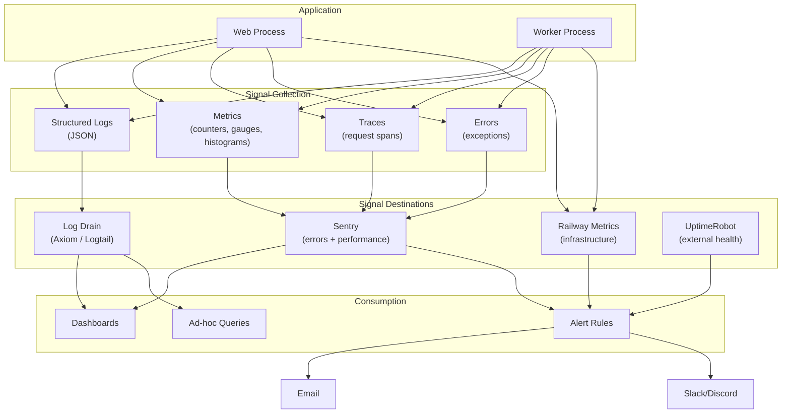
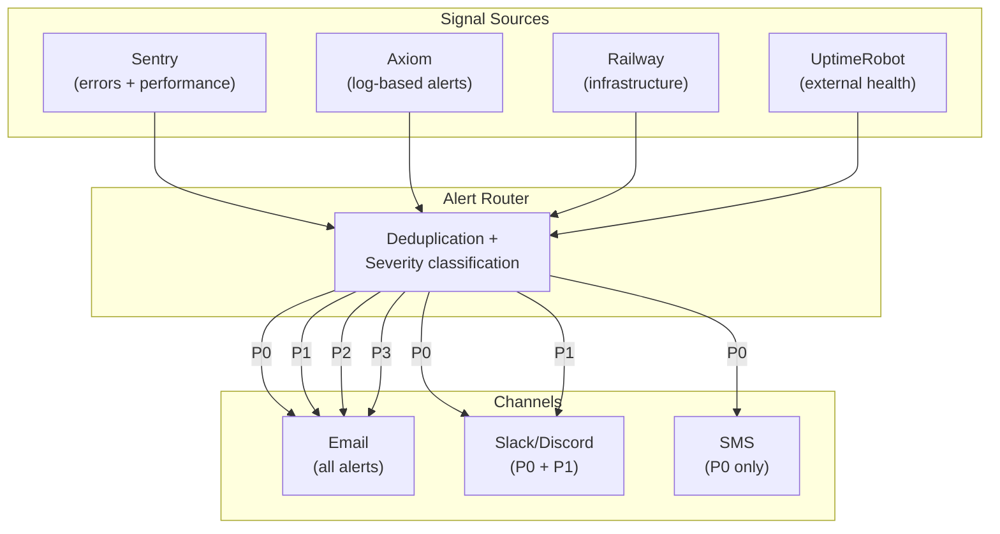
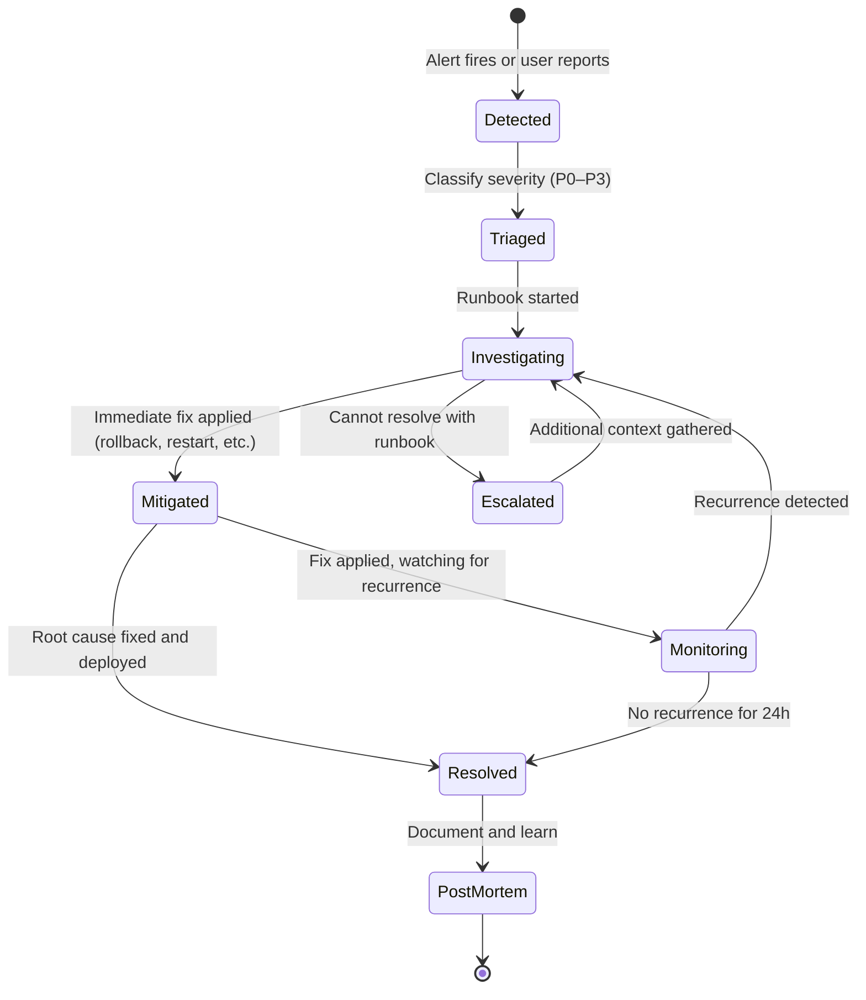

# Document 19: Operations, Monitoring & Incident Response

## 1. Purpose and Scope

Documents 16, 17, and 18 established *what* is monitored (security events, infrastructure metrics, cost thresholds), *where* the system runs (Railway, Postgres, Cloudflare), and *how* it scales (pg-boss, incremental verification, model routing). This document defines *how operations are conducted* once the system is live — the monitoring architecture that ties all signals together, the alerting strategy that surfaces problems before users notice them, the runbooks that turn alerts into actions, and the incident response process that minimizes damage when things go wrong.

For a solo-built product (Document 1 §9), "operations" is not a team of SREs with PagerDuty rotations — it's one developer who needs to know immediately when something breaks, understand what broke without context-switching into an investigation, and fix it quickly with pre-written procedures. This document optimizes for that reality.

### What this document resolves

| Open question | Source | Resolution section |
|---|---|---|
| Log drain destination | Document 17 §21 | §4.3 |

### Relationship to other documents

| Document | What it established | What this document adds |
|---|---|---|
| Document 5 §3 | 99.5% uptime target | SLOs, error budgets, and the monitoring that enforces them (§12, §13) |
| Document 5 §7 | Sentry + structured logging as the observability stack | The complete monitoring architecture connecting Sentry, logs, metrics, and traces (§3) |
| Document 16 §18–19 | Security events to log; incident classification (P0–P3); credential rotation plan | Operational runbooks that implement those classifications (§11); postmortem process (§18) |
| Document 17 §18 | Infrastructure alert rules (8 rules with thresholds) | Alert routing, escalation, and deduplication across all signal types (§9) |
| Document 18 §12.5 | Cost monitoring thresholds | Cost alerts integrated into the unified alerting strategy (§9) |
| Document 18 §17 | Failure modes and recovery | Runbooks for each failure mode (§11) |

### What this document does not define

- The monitoring *system's* own deployment and scaling — it runs on the same Railway infrastructure (Document 17) and scales with it.
- Security-specific logging events — fully defined in Document 16 §18; referenced here, not duplicated.
- Test-environment observability — Document 15 §14 covered this; this document is production-focused.

---

## 2. Operational Principles

1. **Observe everything, alert selectively.** Every significant system event is logged. But not every logged event triggers an alert. Alerts fire only when human attention is required *now* — a state that, if left unaddressed, will degrade user experience or cost money. Alert fatigue is a real operational risk for a solo developer: too many alerts train the operator to ignore them, which is worse than no alerts at all.

2. **Every alert has a runbook.** An alert that says "database CPU is high" without explaining what to do about it is a distraction, not a tool. Every alert defined in this document links to a runbook (§11) that specifies: what the alert means, what to check first, what to do, and when to escalate. The runbook is the alert's justification for existing.

3. **Structured data over free text.** Logs are JSON. Metrics are labeled. Traces have span names. Every operational signal is machine-parseable so that queries like "show me all LLM calls that took > 30 seconds in the last hour" are SQL/grep queries, not manual log reading.

4. **Correlation across signals.** A single user request may generate a log entry, a metric data point, a trace span, and (if it fails) a Sentry event. All of these must share a `requestId` so that investigating an incident involves following one ID across all signal types, not guessing which log entry corresponds to which error.

5. **Cost of observability is bounded.** Log volume, metric cardinality, and Sentry event count must stay within free-tier or low-cost-tier limits (Document 17 §19). A monitoring system that costs more than the infrastructure it monitors is a failed design.

---

## 3. Monitoring Architecture

### 3.1 Signal types



### 3.2 Signal correlation

Every request and job that enters the system is assigned a `requestId` (UUID v4) at the entry point:

- **Web process:** `requestId` is generated in the first middleware, before any route handler runs. It's included in every log entry, every Sentry breadcrumb, and every trace span for that request. It's also returned in the `X-Request-Id` response header for client-side correlation.
- **Worker process:** when a job is dequeued, a `jobRequestId` is generated (or the original `requestId` from the enqueuing request is carried forward). Every log entry and trace span for that job includes both the `jobId` (from the queue) and the `requestId` (from the original trigger).

This means an investigation path like "user reported that generation failed → find the Sentry error → get the requestId → query logs for that requestId → see the full request lifecycle including the job that was enqueued and the LLM call that failed" is a single-ID lookup across all systems.

---

## 4. Logging Strategy

### 4.1 Log format

Every log entry is a JSON object with these guaranteed fields:

```json
{
  "timestamp": "2025-03-15T14:32:07.123Z",
  "level": "info",
  "message": "LLM generation completed",
  "requestId": "uuid",
  "service": "generation",
  "environment": "production",
  "userId": "uuid",
  "workspaceId": "uuid",
  "duration_ms": 12450,
  "metadata": {
    "model": "claude-sonnet-4-20250514",
    "inputTokens": 8234,
    "outputTokens": 3102,
    "artifactType": "architecture",
    "projectId": "uuid"
  }
}
```

**Guaranteed fields** (present on every log entry): `timestamp`, `level`, `message`, `requestId`, `service`, `environment`. **Contextual fields** (present when applicable): `userId`, `workspaceId`, `duration_ms`, `metadata`. **Never present**: passwords, tokens, API keys, session cookies, or any field matching Document 16 §18.2's redaction patterns.

### 4.2 Log levels

| Level | Meaning | Volume expectation | Example |
|---|---|---|---|
| `error` | Something failed that should not have; requires investigation | < 10/hour in healthy state | Unhandled exception; LLM call failed after retry; database constraint violation |
| `warn` | Something unexpected happened but was handled; may indicate a developing problem | < 50/hour | LLM call retry triggered; rate limit approached (80% of threshold); slow database query (> 100ms) |
| `info` | Normal operational event worth recording | ~100–500/hour at moderate usage | Request received; job enqueued; job completed; LLM call completed; verification run started/finished |
| `debug` | Detailed diagnostic information | Disabled in production by default; enabled per-service via config flag for troubleshooting | Full prompt text (redacted); detailed query plan; cache hit/miss |

**Production log level: `info`.** This captures enough to investigate most incidents without the volume cost of `debug`. When a specific issue requires deeper visibility, `debug` is enabled for the relevant service via an environment variable change (Document 17 §13) — no code change, no redeploy.

### 4.3 Log drain (resolves Document 17 §21)

**Decision: Axiom.**

| Option | Free tier | Retention | Query capability | Cost at scale |
|---|---|---|---|---|
| Railway built-in | Unlimited (while deployed) | 7 days | Basic text search | Free |
| Datadog | 1 day retention | Paid: 15 days+ | Excellent | Expensive (~$0.10/GB ingested) |
| Logtail (Better Stack) | 1GB/month | 3 days | Good | $25/month for 30-day retention |
| **Axiom** | 500GB/month | 30 days | Excellent (SQL-like APL queries) | Free tier is generous; $25/month for 90-day retention |

**Rationale:** Axiom's free tier (500GB/month, 30-day retention) is generous enough for v1's log volume (~1–5GB/month at moderate usage) with headroom for growth. Its query language (APL, similar to Kusto) supports the structured queries that operational debugging requires ("show me all LLM calls for user X in the last 24 hours where duration > 30s"). Railway supports Axiom as a native log drain — configuration is a single environment variable, no agent installation.

**Implementation:** Railway's log drain pipes all stdout/stderr from the web and worker processes to Axiom. Since all application logging is structured JSON to stdout (§4.1), Axiom automatically parses the fields and makes them queryable.

### 4.4 Log volume management

At 100 users with moderate activity, estimated log volume:

| Source | Events/hour | Size/event | Daily volume |
|---|---|---|---|
| API request logs | ~500 | ~500 bytes | ~6 MB |
| Job lifecycle logs | ~100 | ~800 bytes | ~2 MB |
| LLM call logs | ~50 | ~1 KB | ~1.2 MB |
| Security events | ~20 | ~500 bytes | ~0.25 MB |
| **Total** | | | **~10 MB/day** |

At 10 MB/day × 30 days = ~300 MB/month — well within Axiom's 500GB free tier even at 10× this volume.

**High-volume log suppression:** if a specific log entry fires more than 100 times in 1 minute (indicating a loop or cascade), the logging layer switches to sampling (log 1 in 10) with a `sampled: true` flag and a `sampleRate: 10` field. This prevents a burst of errors from consuming the entire log budget.

---

## 5. Metrics Collection

### 5.1 Application metrics

Metrics are collected via Sentry Performance and custom counters:

| Metric | Type | Labels | Purpose |
|---|---|---|---|
| `api.request.duration` | Histogram | `method`, `path`, `status` | API latency by endpoint |
| `api.request.count` | Counter | `method`, `path`, `status` | Request volume and error rate |
| `job.duration` | Histogram | `type` (generation/verification), `status` | Job processing time |
| `job.queue.depth` | Gauge | `queue` (generation-single/generation-pipeline/verification) | Current queue depth per priority |
| `job.queue.wait_time` | Histogram | `queue` | Time from enqueue to job start |
| `llm.call.duration` | Histogram | `model`, `operation` (generate/verify), `stage` | LLM API latency |
| `llm.call.tokens.input` | Counter | `model`, `operation` | Input token consumption |
| `llm.call.tokens.output` | Counter | `model`, `operation` | Output token consumption |
| `llm.call.cost` | Counter | `model`, `operation` | Estimated cost per call |
| `llm.call.errors` | Counter | `model`, `error_type` (timeout/rate_limit/server_error) | LLM API failure tracking |
| `verification.findings.count` | Counter | `severity`, `spec_area`, `detection_tier` | Finding distribution |
| `verification.tier1.duration` | Histogram | — | Deterministic tier performance |
| `verification.tier2.duration` | Histogram | — | Semantic tier performance |
| `db.query.duration` | Histogram | `operation` (select/insert/update) | Database query performance |
| `db.pool.active` | Gauge | — | Active database connections |
| `db.pool.waiting` | Gauge | — | Requests waiting for a connection |

### 5.2 Infrastructure metrics (Railway-provided)

| Metric | Source | Alert threshold (from Document 17 §18.2) |
|---|---|---|
| CPU usage | Railway dashboard | > 80% sustained for 5 min |
| Memory usage | Railway dashboard | > 85% sustained for 5 min |
| Network I/O | Railway dashboard | No alert (informational) |
| Disk usage | Railway dashboard | > 80% |

### 5.3 Business metrics

These aren't operational alerts — they're product health signals tracked over time:

| Metric | Computation | Insight |
|---|---|---|
| Daily active users | Distinct `userId` in API request logs | Product adoption trend |
| Generation runs per day | Count of completed generation jobs | Feature usage |
| Verification runs per day | Count of completed verification runs | Core value delivery |
| Findings per verification run (avg) | `findings.count / verification_runs.count` | Verification utility — too many findings may indicate noise; too few may indicate missed issues |
| Re-verification rate | Percentage of verification runs for projects that have been verified before | Retention loop health (Document 7 Journey 2) |
| Full-pipeline vs. single-stage ratio | Pipeline runs / single-stage runs | Whether users prefer step-by-step or all-at-once |

---

## 6. Distributed Tracing

### 6.1 Why tracing matters for Verity

A single "verify my project" action from the user triggers a chain of operations:

```
HTTP request → Job enqueue → Job dequeue → Repo ingestion (GitHub API) →
  Tier 1 parsing (tree-sitter, 500 files) → Tier 2 batch 1 (LLM call) →
  Tier 2 batch 2 (LLM call) → Tier 2 batch 3 (LLM call) →
  Finding persistence → Job completion
```

Without tracing, debugging "verification was slow" requires correlating timestamps across dozens of log entries. With tracing, the entire operation is one trace with spans showing exactly where time was spent.

### 6.2 Trace structure

```mermaid
gantt
    title Verification Run Trace (example)
    dateFormat X
    axisFormat %s

    section HTTP
    POST /api/projects/:id/verify     :0, 200

    section Job Queue
    Queue wait                        :200, 3000

    section Repo Ingestion
    GitHub API fetch                  :3000, 8000
    File filtering + disk write       :8000, 9000

    section Tier 1
    AST parsing (350 files)           :9000, 35000
    Schema matching                   :35000, 40000
    Auth detection                    :40000, 45000

    section Tier 2
    Batch 1: auth files (LLM)         :45000, 70000
    Batch 2: schema files (LLM)       :45000, 68000
    Batch 3: API files (LLM)          :45000, 72000
    Batch 4: other files (LLM)        :45000, 65000

    section Persistence
    Finding writes                    :72000, 74000
    Run status update                 :74000, 75000
```

### 6.3 Implementation

Sentry Performance provides tracing with automatic span collection for:
- HTTP requests (incoming and outgoing)
- Database queries (via ORM instrumentation)
- Custom spans (added manually for LLM calls, AST parsing, and job lifecycle)

**Custom spans added by Verity:**

```typescript
// Pseudocode — illustrative
const transaction = Sentry.startTransaction({ name: 'verification.run' });

const ingestionSpan = transaction.startChild({ op: 'repo.ingestion' });
await ingestRepo(repoConnection);
ingestionSpan.finish();

const tier1Span = transaction.startChild({ op: 'verification.tier1' });
const deterministicFindings = await runDeterministicChecks(spec, repoFiles);
tier1Span.finish();

for (const batch of verificationBatches) {
  const tier2Span = transaction.startChild({ 
    op: 'verification.tier2.batch',
    data: { batchIndex: batch.index, fileCount: batch.files.length }
  });
  const semanticFindings = await runSemanticCheck(spec, batch);
  tier2Span.finish();
}

transaction.finish();
```

### 6.4 Sampling

Sentry's free tier allows 10K transactions/month. At moderate usage (~500 transactions/day = ~15K/month), sampling at 50% keeps within the limit while capturing enough data for performance analysis:

```typescript
Sentry.init({
  tracesSampleRate: process.env.NODE_ENV === 'production' ? 0.5 : 1.0,
  // In staging/dev, capture everything
});
```

If Sentry's transaction quota is exhausted, traces degrade gracefully — the application continues working; performance data stops being collected until the quota resets.

---

## 7. AI Monitoring

### 7.1 LLM call monitoring

Every LLM call is logged and traced with:

| Field | Type | Purpose |
|---|---|---|
| `model` | string | Which model was used (Sonnet, Haiku) |
| `operation` | enum | `generation`, `verification_semantic` |
| `stage` | string | Which pipeline stage (prd, architecture, schema, etc.) |
| `inputTokens` | integer | Prompt token count |
| `outputTokens` | integer | Response token count |
| `estimatedCost` | float | Calculated from token counts × per-token price |
| `duration_ms` | integer | Total call duration including network |
| `success` | boolean | Whether the call returned a valid response |
| `retried` | boolean | Whether this was a retry of a previously failed call |
| `validationPassed` | boolean | Whether the response passed Zod validation |
| `cacheHit` | boolean | Whether Anthropic's prompt cache was used |

### 7.2 Quality signals

Beyond operational metrics, AI monitoring tracks quality signals that feed into Document 15 §7.5's AI evaluation:

| Signal | Computation | Concern threshold |
|---|---|---|
| Zod validation failure rate | Failed validations / total LLM calls | > 5% (model output quality degrading) |
| Retry rate | Retried calls / total calls | > 10% (API instability or prompt issues) |
| Hallucination rate | Discarded findings (Document 16 §9.4) / total findings | > 5% (model producing unreliable output) |
| Average confidence score (Tier 2) | Mean of all semantic finding confidence values | < 0.7 (model uncertain; findings may be noisy) |
| Cost per generation run (trailing average) | Sum of `estimatedCost` for generation jobs / count | > 2× historical average (prompt regression or model pricing change) |

### 7.3 Model version monitoring

When the LLM provider updates their model (e.g., Claude Sonnet 4 → next version), output quality can shift without any code change on Verity's side. The monitoring strategy:

- **Detection:** log the model version string returned in the API response (Anthropic includes this). If the version changes, log a `warn`-level event: "LLM model version changed from X to Y."
- **Automated response:** trigger the AI evaluation suite (Document 15 §7.5) to run against the new model version. If quality metrics drop below thresholds, alert.
- **Manual response:** review the evaluation results; if quality degraded, either pin to the previous model version (if the API supports it) or update prompts to adapt.

---

## 8. Verification Monitoring

Verification is the product's core value (Document 3). Its operational health deserves dedicated monitoring beyond general job monitoring.

### 8.1 Verification-specific metrics

| Metric | Healthy range | Concern range | Alert threshold |
|---|---|---|---|
| Tier 1 duration (500-file repo) | < 30s | 30–60s | > 60s (Document 5 §1 target) |
| Tier 2 duration (4 batches) | < 2 min | 2–3 min | > 3 min (Document 5 §1 target) |
| Total verification duration | < 3 min | 3–5 min | > 5 min |
| Findings per run (average) | 2–20 | 0 or > 50 | 0 across 10+ runs (verification may be broken) or > 100 (noise) |
| False positive rate (from user feedback, future) | < 15% | 15–25% | > 25% (trust erosion) |
| Tier 1 precision | 100% | < 100% | Any false positive in Tier 1 (deterministic checks should never be wrong) |
| Incremental cache hit rate | > 60% (re-verification) | < 40% | < 20% (caching not working) |

### 8.2 Verification health dashboard

A single view that answers "is verification working well?":

| Panel | Visualization | Data source |
|---|---|---|
| Verification runs per day | Time-series line chart | `job.duration` metric filtered by type=verification |
| Duration breakdown (Tier 1 vs. Tier 2) | Stacked bar chart | `verification.tier1.duration` + `verification.tier2.duration` |
| Finding severity distribution | Pie chart / donut | `verification.findings.count` by severity |
| Findings by spec area | Horizontal bar chart | `verification.findings.count` by spec_area |
| LLM call success rate (Tier 2) | Percentage gauge | `llm.call.errors` / total calls for verification |
| Average confidence score | Single stat | Mean of confidence values from recent runs |
| Queue wait time (verification queue) | Time-series line | `job.queue.wait_time` for verification queue |

This dashboard is not a UI screen in the product — it's an operational tool built in Axiom or Sentry's dashboards, used by the developer to monitor verification health.

---

## 9. Alerting Strategy

### 9.1 Alert taxonomy

Document 17 §18.2 defined 8 alert rules. This section consolidates all alerts across the system into a unified taxonomy with routing, escalation, and deduplication:



### 9.2 Complete alert catalog

| ID | Alert name | Source | Threshold | Severity | Runbook |
|---|---|---|---|---|---|
| **A1** | Service down | UptimeRobot | 2 consecutive health check failures | P0 | §11.1 |
| **A2** | Error rate spike | Sentry | > 10 errors/minute (5× baseline) | P1 | §11.2 |
| **A3** | LLM API outage | Sentry/Axiom | > 50% LLM call failure rate in 10-min window | P1 | §11.3 |
| **A4** | LLM cost anomaly | Axiom | > $10/hour (5× average) | P1 | §11.4 |
| **A5** | Database CPU high | Railway | > 80% sustained for 5 min | P2 | §11.5 |
| **A6** | Memory usage high | Railway | > 85% sustained for 5 min | P2 | §11.6 |
| **A7** | Queue depth critical | Axiom | > 50 jobs for 10 min | P2 | §11.7 |
| **A8** | Disk usage high | Railway | > 80% | P2 | §11.8 |
| **A9** | Verification quality degradation | Axiom | Zod validation failure rate > 5% | P2 | §11.9 |
| **A10** | Monthly cost approaching cap | Axiom | > $400 LLM spend (80% of $500 cap) | P1 | §11.10 |
| **A11** | Backup failure | GitHub Actions | Weekly backup job failed | P2 | §11.11 |
| **A12** | Security: auth failure spike | Axiom | > 50 failed logins in 5 min from same IP | P2 | §11.12 |
| **A13** | Slow API responses | Sentry | p95 API latency > 2s sustained for 10 min (excluding LLM-bound endpoints) | P2 | §11.5 |

### 9.3 Alert deduplication

When multiple alerts fire from the same root cause (e.g., a database outage triggers A1, A2, A5, and A13 simultaneously), deduplication prevents alert spam:

- **Time-based grouping:** alerts of the same type within a 5-minute window are grouped into one notification. The notification includes the count ("Error rate spike — 3 occurrences in the last 5 minutes") rather than 3 separate notifications.
- **Severity escalation:** if a P2 alert escalates (e.g., database CPU stays high for 30 minutes), it's re-sent as P1 rather than repeating the P2 notification. Escalation thresholds: P2 → P1 after 30 minutes unresolved; P1 → P0 after 1 hour unresolved (indicating systematic failure).
- **Sentry's built-in dedup:** Sentry groups identical errors by stack trace; a single error happening 1,000 times appears as one issue with a count, not 1,000 separate alerts.

### 9.4 Alert routing for a solo developer

| Time of day | P0 behavior | P1 behavior | P2 behavior |
|---|---|---|---|
| Working hours (9am–9pm) | Email + Slack + SMS (immediate) | Email + Slack | Email (batched hourly) |
| Off hours (9pm–9am) | Email + SMS | Email (next morning) | Email (next morning) |
| Weekend | Email + SMS | Email (Monday morning) | Email (Monday morning) |

P2 alerts are batched outside working hours because they represent developing problems, not emergencies — a database at 82% CPU usage at 11pm doesn't need a midnight investigation.

---

## 10. Incident Response

### 10.1 Incident lifecycle

Document 16 §19 defined the classification (P0–P3) and the high-level playbook. This section operationalizes it:



### 10.2 Incident communication

For a solo-developer product, incident communication is minimal but structured:

- **Internal tracking:** a simple incident log (markdown file in the repository or a notion/linear board) recording: timestamp, severity, summary, root cause, resolution, duration.
- **User-facing (if users are affected):** a status page (even a simple static page at `status.verity.app`) showing: current status (operational/degraded/outage), last updated timestamp, and a one-line description. Updated manually during P0/P1 incidents.
- **Post-incident:** if user data was affected (Document 16 §19.2 step 3), direct email notification.

### 10.3 Response time targets

Aligned with Document 16 §19.1:

| Severity | Detection → Triage | Triage → Mitigation | Triage → Resolution |
|---|---|---|---|
| P0 | < 5 min (automated alert) | < 30 min | < 4 hours |
| P1 | < 15 min | < 2 hours | < 24 hours |
| P2 | < 1 hour | < 24 hours | < 1 week |
| P3 | Next working session | Best effort | Best effort |

---

## 11. Runbooks

Each runbook follows the format: **What it means → What to check → What to do → When to escalate.**

### 11.1 RB-A1: Service Down

**What it means:** the public health endpoint (`GET /api/health`) is unreachable from outside the network. Users cannot access the application.

**What to check:**
1. Railway dashboard → is the web service running? If not, check deploy logs.
2. Railway dashboard → recent deployments? A bad deploy may have crashed the container.
3. Cloudflare dashboard → DNS resolving correctly? Is Cloudflare itself having an outage?

**What to do:**
- If container crashed: Railway auto-restarts. Wait 2 minutes. If still down, check container logs for crash reason (OOM? Uncaught exception?).
- If bad deploy: roll back to previous version via Railway dashboard (< 1 minute).
- If DNS issue: check Cloudflare status page. If Cloudflare is down, wait (out of our control). If DNS misconfigured, fix in Cloudflare dashboard.
- If Railway outage: check Railway status page. If confirmed, communicate to users via status page. Consider emergency deploy to Render/Fly.io (Document 17 §16.2).

**When to escalate:** if the service is down for > 30 minutes with no clear cause, investigate infrastructure provider issues.

### 11.2 RB-A2: Error Rate Spike

**What it means:** the application is producing errors at 5× the normal rate. Users are likely experiencing failures.

**What to check:**
1. Sentry → new error issues created in the last 15 minutes.
2. Most common error → is it one error happening many times (likely a code bug) or many different errors (likely an infrastructure issue)?
3. Did a deployment happen in the last 30 minutes? (Most common cause.)

**What to do:**
- If post-deploy: roll back (§15.1 runbook in Document 17).
- If one specific error: investigate the stack trace in Sentry; find the `requestId`; trace through Axiom logs.
- If database-related errors: check database health (A5 runbook).
- If LLM-related errors: check LLM health (A3 runbook).

### 11.3 RB-A3: LLM API Outage

**What it means:** > 50% of Claude API calls are failing. Generation and Tier 2 verification are degraded.

**What to check:**
1. Anthropic status page — is there a known outage?
2. Axiom → filter logs by `service=generation OR service=verification` and `success=false`. What error types? (timeout, rate_limit, 5xx?)
3. Has the API key been rotated or revoked?

**What to do:**
- If Anthropic outage: nothing to fix on our side. Queue will accumulate jobs; they'll process when the API recovers. No data loss.
- If rate limited: reduce worker concurrency temporarily. Check if an anomalous user is triggering excessive runs.
- If API key issue: verify the key in Anthropic console; rotate if needed (Document 16 §19.3).
- Impact on users: generation and verification are unavailable; all other features (spec viewing, editing, project management) continue working.

### 11.4 RB-A4: LLM Cost Anomaly

**What it means:** LLM spend exceeded $10/hour (5× the expected ~$2/hour average).

**What to check:**
1. Axiom → group LLM calls by `userId` in the last hour. Is one user responsible?
2. Check per-call token counts — are individual calls using unusually many tokens?
3. Check if a prompt regression was deployed (prompts grew longer).

**What to do:**
- If one user generating excessive load: check if the per-user daily cap ($20) has been hit. If not, the cap will catch it.
- If per-call tokens spiked: a prompt change likely included too much context. Investigate the most recent deployment.
- If sustained: temporarily reduce the system-wide job concurrency to throttle spend while investigating.
- If approaching monthly cap ($500): consider enabling model routing to Haiku for non-critical operations (Document 18 §18.1).

### 11.5 RB-A5/A13: Database/API Performance Degradation

**What it means:** database CPU is high, or API responses are slow.

**What to check:**
1. Railway → database metrics. CPU, connections, disk I/O.
2. Axiom → `db.query.duration` metrics. Any queries > 100ms?
3. Sentry Performance → slowest transactions in the last hour.

**What to do:**
- If specific slow query: check for missing index (§5.3 in Document 18). Add index if needed.
- If connection exhaustion: increase pool size or add PgBouncer (Document 18 §5.2).
- If general overload: vertical scale the database (Document 18 §4).
- Temporary mitigation: reduce worker concurrency to lower database load.

### 11.6 RB-A6: Memory Usage High

**What to check:** which process (web or worker) is consuming memory? Check Railway metrics per service.

**What to do:**
- If worker during verification: a large repo is likely being processed. The verification timeout (Document 18 §13.4) will bound this.
- If web process: possible memory leak. Check Sentry for increasing memory trend. Restart the container (Railway → restart service). If recurring, investigate with heap snapshots in staging.
- Immediate: vertically scale the container (512MB → 1GB).

### 11.7 RB-A7: Queue Depth Critical

**What it means:** > 50 jobs waiting. Users will experience long wait times.

**What to check:**
1. Are workers running? Check Railway → worker service status.
2. Is the LLM API responding? (A stalled LLM API causes jobs to pile up.)
3. Is one user flooding the queue?

**What to do:**
- If workers stopped: restart via Railway dashboard.
- If LLM API slow: jobs are processing, just slowly. Communicate expected delay to users if possible.
- If user flooding: per-user concurrent job limit (Document 18 §14.2) should prevent this. If it's not enforced, add it.
- Scale-up: temporarily add worker instances (Document 18 §3.3).

### 11.8 RB-A8: Disk Usage High

**What to check:** ephemeral repo storage cleanup — is the 30-minute safety cron (Document 16 §11.3) running?

**What to do:**
- Immediate: manually clear `/tmp/verity-repos/` on the worker container.
- Fix: verify the cleanup cron is operational. Check logs for cleanup errors.

### 11.9 RB-A9: Verification Quality Degradation

**What it means:** LLM responses are failing Zod validation at > 5% rate. The model may be producing lower-quality output.

**What to check:**
1. Has the model version changed? (§7.3.)
2. Has a prompt been modified recently?
3. What specific validation errors are occurring? (Missing fields? Wrong types? Malformed JSON?)

**What to do:**
- If model version changed: run the AI evaluation suite (Document 15 §7.5). If quality dropped significantly, pin to previous model version if possible.
- If prompt regression: revert the prompt change.
- If transient: monitor for 24 hours. LLM output quality can vary with provider-side changes.

### 11.10 RB-A10: Monthly Cost Approaching Cap

**What to do:**
- Review cost breakdown: which operations are consuming the most tokens?
- Enable model routing if not already active (Haiku for roadmap/tasks).
- Enable prompt caching if not already active.
- Consider reducing Tier 2 batches from 4 to 3 for the remainder of the month.
- If still approaching cap: communicate to users that generation/verification may be temporarily limited.

### 11.11 RB-A11: Backup Failure

**What to check:** GitHub Actions → backup workflow run. Why did it fail? (Database connection issue? R2 upload failure? Credential expiry?)

**What to do:**
- Fix the failure cause and re-run the workflow manually.
- If the database credential is expired: rotate it (Document 16 §19.3).
- Verify the backup is restorable (Document 17 §17.3's monthly restoration test).

### 11.12 RB-A12: Auth Failure Spike

**What it means:** > 50 failed logins from one IP in 5 minutes. Possible credential stuffing attack.

**What to do:**
- Check if the IP is a known bot/scanner (GeoIP lookup).
- Better Auth's built-in rate limiting on auth endpoints should already block this. Verify it's active.
- If attack is sustained: temporarily block the IP at the Cloudflare level (WAF rule).
- No user data is at risk unless the attack succeeds (credential match). Monitor for successful logins from unusual IPs.

---

## 12. Error Budgets

### 12.1 Concept

An error budget quantifies how much unreliability the system can tolerate before violating its SLO. It converts the abstract "99.5% uptime" target into a concrete time allowance.

### 12.2 Calculation

```
SLO: 99.5% availability
Measurement period: 30 days

Total minutes in 30 days: 43,200
Error budget: 0.5% × 43,200 = 216 minutes (3.6 hours) per month

Meaning: the system can be unavailable for up to 3.6 hours per month
before violating the 99.5% SLO.
```

### 12.3 Error budget policy

| Budget remaining | Policy |
|---|---|
| > 50% (> 108 min remaining) | Normal operations. Deploy freely. Risk tolerance for experiments |
| 25–50% (54–108 min remaining) | Caution. Avoid risky deployments (large refactors, infrastructure changes). Prioritize reliability fixes |
| < 25% (< 54 min remaining) | Freeze. Only deploy critical bug fixes and security patches. No feature deployments. Investigate why budget is being consumed |
| Exhausted | All hands on reliability. Root-cause every outage. No deployments until next month or until systemic issues are resolved |

### 12.4 Tracking

Error budget consumption is tracked via UptimeRobot's uptime percentage (simplest implementation). A monthly review checks: how much budget was consumed, what incidents consumed it, and whether the SLO is at risk.

---

## 13. SLOs & SLAs

### 13.1 Service Level Objectives (internal targets)

| SLO | Target | Measurement | Window |
|---|---|---|---|
| **Availability** | 99.5% | UptimeRobot health check success rate | 30-day rolling |
| **API latency (non-LLM)** | p95 < 500ms | Sentry Performance: transaction duration for GET endpoints | 30-day rolling |
| **Generation completion** | 95% success rate | Completed generation jobs / total triggered | 7-day rolling |
| **Verification completion** | 95% success rate | Completed verification jobs / total triggered | 7-day rolling |
| **Job queue wait time** | p95 < 2 minutes | `job.queue.wait_time` metric | 7-day rolling |

### 13.2 Service Level Agreements (external commitments)

v1 does not offer formal SLAs to users. The SLOs above are internal targets that guide operational decisions. If Verity transitions to a paid product (Document 21), SLAs will be derived from these SLOs with an appropriate margin (e.g., SLO of 99.5% → SLA of 99.0%).

---

## 14. Health Checks

### 14.1 Health check taxonomy

Document 17 §11.3 defined the basic health check. This section extends it:

| Endpoint | Type | Checks | Used by | Frequency |
|---|---|---|---|---|
| `GET /api/health` | **Shallow** | Node.js process is responding | Railway container orchestration; UptimeRobot | Every 30s |
| `GET /api/health/deep` | **Deep** | Process + Postgres connection + queue responsiveness | Manual debugging; operational dashboard | On-demand |
| `GET /api/health/ready` | **Readiness** | Process + config loaded + database migrations current | Deploy pipeline (Document 17 §14.4) | At deploy time |

### 14.2 Deep health check response

```json
{
  "status": "healthy",
  "version": "abc123f",
  "uptime_seconds": 86400,
  "checks": {
    "database": { "status": "healthy", "latency_ms": 3 },
    "queue": { "status": "healthy", "depth": 2 },
    "llm": { "status": "healthy", "lastCallAge_seconds": 120 }
  }
}
```

**LLM health is passive:** the deep health check does not make an LLM call to check if the API is available (that would cost money). Instead, it reports the time since the last successful LLM call. If `lastCallAge_seconds` exceeds 1 hour during active usage, the LLM API may be unreachable.

### 14.3 Health check security

Health endpoints are unauthenticated (they need to be accessible by UptimeRobot and Railway without a session). But:
- `/api/health` returns only `status` and `version` — no internal state.
- `/api/health/deep` returns operational detail that could aid an attacker (database latency, queue depth). It is rate-limited aggressively (5 requests/minute) and could be restricted to internal network only in a more security-sensitive deployment.

---

## 15. Backup Monitoring

Document 17 §17 defined the backup strategy. Monitoring ensures backups actually work:

| Check | Method | Frequency | Alert on failure |
|---|---|---|---|
| Daily automated snapshot completed | Railway dashboard / API | Daily | P2 — A11 |
| Weekly off-site backup completed | GitHub Actions workflow status | Weekly | P2 — A11 |
| Monthly restoration test passed | Manual verification (Document 17 §17.3) | Monthly | P2 (manual) |
| Backup size anomaly | Off-site backup size vs. trailing average | Weekly | Warning if size changed > 50% (possible data loss or corruption) |

---

## 16. Capacity Monitoring

Document 18 §15 defined the capacity model. This section monitors whether reality matches the model:

### 16.1 Capacity metrics

| Metric | Current value (track over time) | Threshold for scaling action |
|---|---|---|
| Database storage used | Monitored via Railway | > 60% of provisioned storage |
| Database connection pool utilization | `db.pool.active` / pool max | > 70% sustained |
| Worker CPU utilization during jobs | Railway per-service metrics | > 75% sustained during peak |
| LLM API rate limit utilization | Actual RPM / provider RPM limit | > 60% (approaching limit will cause throttling) |
| Queue depth trend | 7-day trailing average of peak queue depth | Increasing trend across 3 consecutive weeks |

### 16.2 Capacity planning reviews

Monthly review (takes ~15 minutes):

1. Check database storage growth against Document 18 §15.3's projection.
2. Check LLM cost against Document 18 §15.2's estimate for the current user count.
3. Check whether any capacity metric crossed a scaling threshold (§16.1).
4. If a threshold was crossed: implement the corresponding scaling action from Document 18 §3.3.

---

## 17. Production Maintenance

### 17.1 Routine maintenance schedule

| Task | Frequency | Duration | Impact |
|---|---|---|---|
| Dependency update review | Weekly | 30 min | None (review only) |
| Dependency update deployment | Bi-weekly | 1 hour (including test run) | Brief deployment window |
| Database VACUUM/ANALYZE | Automatic (Postgres auto-vacuum) | Continuous background | None |
| Log review for anomalies | Weekly | 15 min | None |
| Error budget check | Monthly | 10 min | None |
| Capacity planning review | Monthly | 15 min | None |
| Backup restoration test | Monthly | 30 min | None (uses separate Postgres instance) |
| AI evaluation suite review | Monthly | 15 min | None |
| Security dependency audit | Monthly | 15 min | None |

**Total operational overhead: ~3–4 hours/month.** This is the honest operational cost of running a production SaaS as a solo developer. It's not zero, but it's bounded and predictable — which is the point of this entire document.

### 17.2 Maintenance windows

v1 does not have scheduled maintenance windows. Deployments are zero-downtime (Document 17 §14.4). Database maintenance (VACUUM, index rebuilds) is handled by Postgres's background processes. If a maintenance window is ever needed (major database migration requiring downtime), it's scheduled for low-traffic hours (weekday 2–4am UTC) with 24-hour advance notice on the status page.

---

## 18. Postmortems

### 18.1 When to write a postmortem

- Every P0 incident (mandatory).
- Every P1 incident that lasted > 1 hour (mandatory).
- Any incident that consumed > 25% of the monthly error budget (mandatory).
- Any incident the developer found interesting or educational (optional but encouraged).

### 18.2 Postmortem format

```markdown
# Postmortem: [Incident Title]

**Date:** YYYY-MM-DD
**Severity:** P0/P1/P2
**Duration:** X hours Y minutes
**Error budget consumed:** Z minutes (N% of monthly budget)

## Summary
One paragraph describing what happened from the user's perspective.

## Timeline
- HH:MM — Alert fired
- HH:MM — Investigation started
- HH:MM — Root cause identified
- HH:MM — Mitigation applied
- HH:MM — Resolved

## Root Cause
Technical description of what went wrong and why.

## Impact
- Users affected: N (or "all")
- Features affected: generation/verification/all
- Data impact: none / data loss / data corruption

## What Went Well
- What detection/response worked as designed.

## What Went Wrong
- What monitoring/processes failed or were missing.

## Action Items
- [ ] Action 1: [description] — owner: [name] — due: [date]
- [ ] Action 2: ...

## Lessons Learned
What this incident taught us about the system.
```

### 18.3 Postmortem storage

Postmortems are stored in the repository under `docs/postmortems/YYYY-MM-DD-title.md`. They are version-controlled, searchable, and serve as a knowledge base for future incidents. For a solo developer, they are also a forcing function for honest reflection — writing "what went wrong" prevents the temptation to fix the bug and move on without addressing the systemic cause.

---

## 19. Future Operational Improvements

### 19.1 Real-time push for alerts (SSE/WebSocket)

Currently, the user learns about system issues only through the status page or error messages. A future improvement: in-app system status notifications ("Verification is currently experiencing delays") pushed via SSE or WebSocket. Architecturally accommodated but not in v1 (Document 4 §6 defers real-time push).

### 19.2 Automated remediation

Some runbooks (§11) have deterministic, automated fixes:

- A8 (disk usage): the safety cron already handles this. Could be enhanced to scale disk automatically.
- A7 (queue depth): auto-scale workers when depth exceeds threshold (Railway supports programmatic scaling).
- A3 (LLM outage): auto-switch to backup LLM provider if available (Document 13's provider abstraction enables this).

Automated remediation is deferred because the failure modes need to be observed in production before trusting automated responses — a premature auto-remediation rule could make things worse.

### 19.3 Synthetic monitoring

Scheduled synthetic transactions (a cron job that creates a test project, runs generation with a mock prompt, and verifies the result) would detect functional regressions that health checks miss. The health check confirms the process is alive; synthetic monitoring confirms the product works end-to-end.

### 19.4 User-facing incident timeline

A richer status page that shows incident history, resolution timelines, and uptime percentage over the last 90 days. Builds trust with users and reduces support inquiries during incidents.

---

## 20. Open Questions

- **Whether Sentry's free-tier transaction quota (10K/month) is sufficient once the product reaches 50+ active users** — at 50% sampling rate and ~500 transactions/day, the quota is consumed in ~40 days (exceeds the monthly reset). Options: reduce sampling to 25%, upgrade Sentry plan (~$26/month), or switch performance monitoring to an open-source alternative (OpenTelemetry → Grafana). Resolved based on actual usage data post-launch.
- **Whether the verification health dashboard (§8.2) should be built in Axiom, Sentry, or as a custom internal page** — Axiom and Sentry both support custom dashboards, but neither may have the exact visualizations needed. A custom page adds development cost but provides full control. Resolved during build phase based on which tool the developer finds most productive.
- **Exact alert channel configuration** — Slack vs. Discord vs. Telegram for push notifications. Depends on the developer's existing communication tools. The architecture supports any webhook-based channel.
- **Whether postmortems should be shared publicly** (on a blog or status page) to build transparency and trust — a product/marketing decision, not a technical one. The postmortem format (§18.2) is designed to be shareable without modification.
