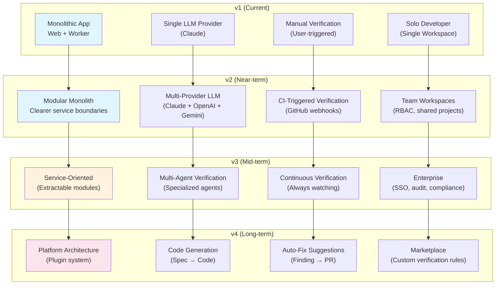
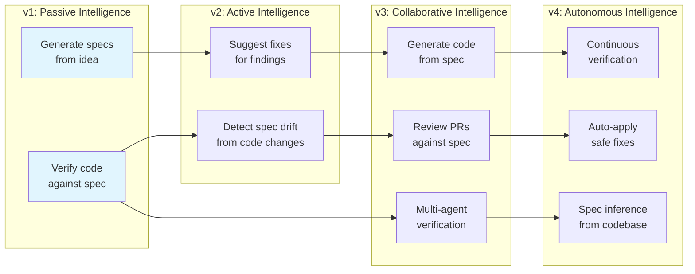
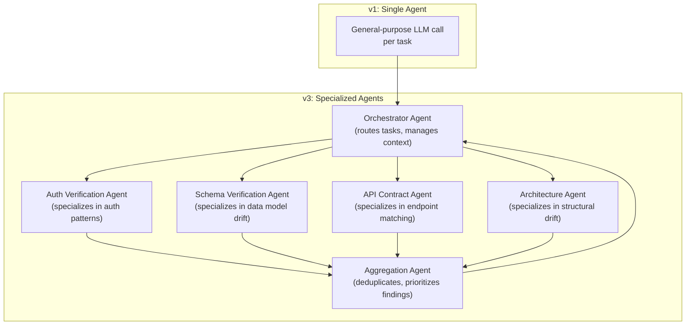
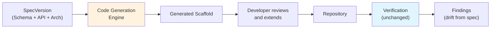
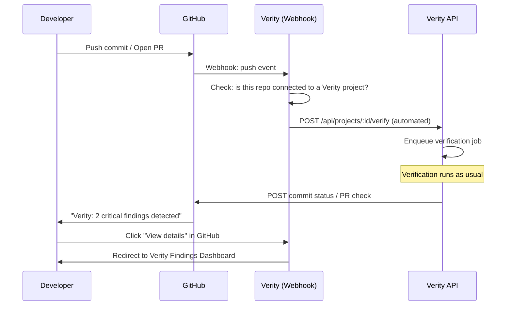
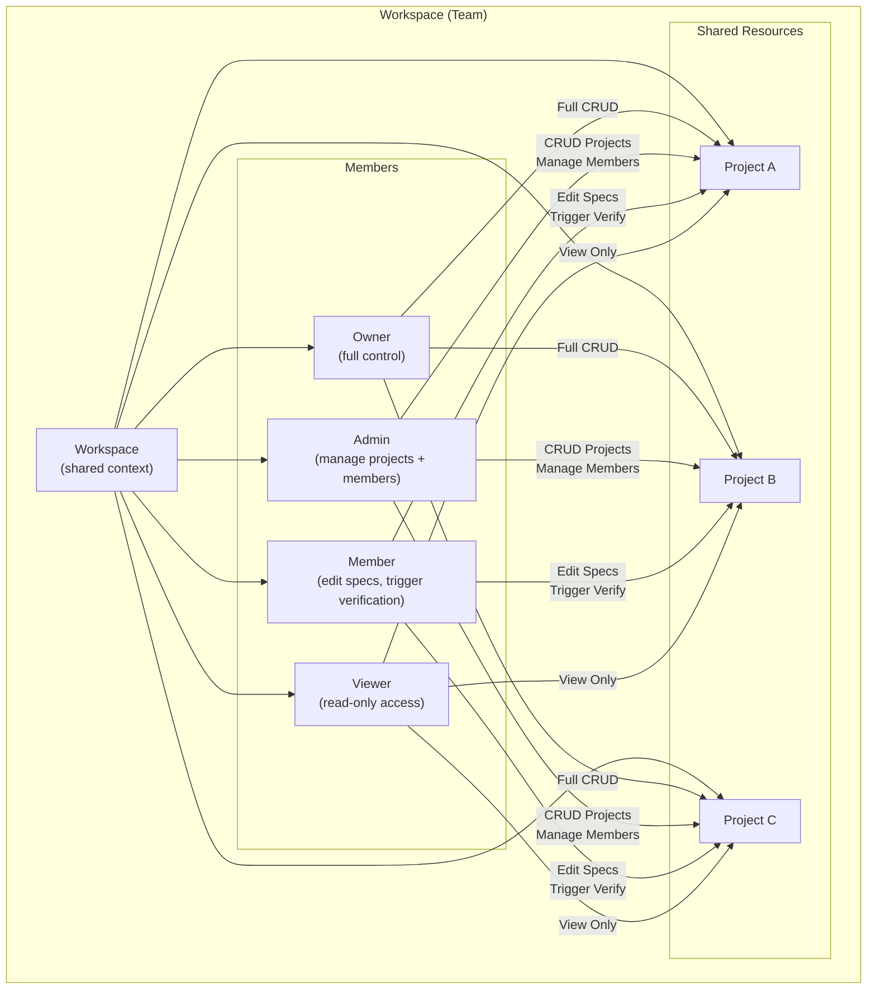
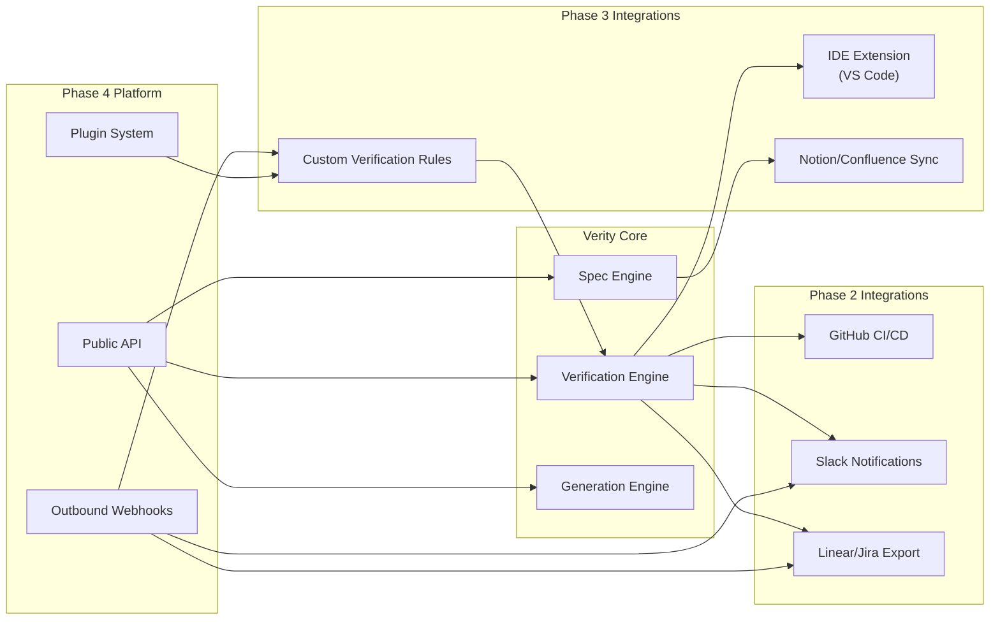
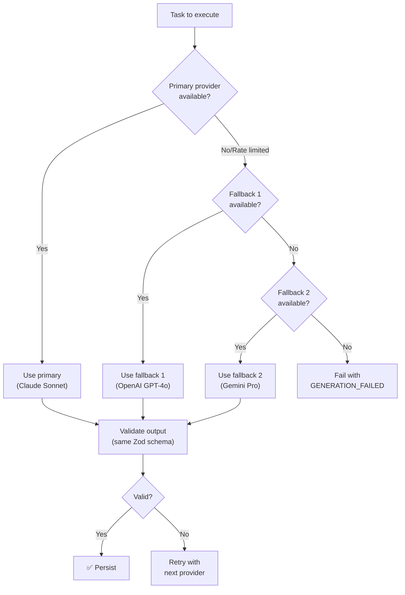
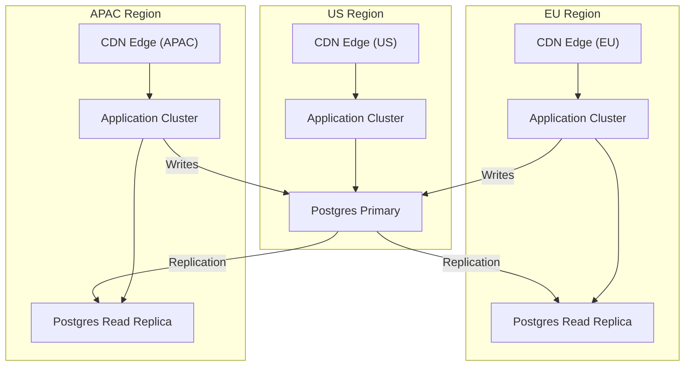

# Document 20: Future Roadmap, Technical Debt & Evolution Strategy

## 1. Purpose and Scope

This is the final document in the Verity Product Requirements Blueprint. Documents 1–19 defined everything needed to build, deploy, and operate the v1 product. This document looks beyond v1: what technical debt the MVP will inevitably accumulate, how the product evolves to serve the personas Document 6 introduced but v1 didn't fully address (Marcus the team lead, Elena the enterprise architect), what architectural bets the team should make next, and — critically — what the system must *not* become.

This document is deliberately different in character from its predecessors. Documents 1–19 are implementation-ready specifications: a developer should be able to build directly from them. This document is a strategic guide: it describes directions, trade-offs, and sequencing principles rather than exact schemas and API routes. The reason is epistemic honesty — the right choices for post-MVP features depend on data (user behavior, market response, cost at scale) that doesn't exist yet.

### What this document does

- Consolidates every "Later" and "Future" item from Documents 1–19 into a prioritized roadmap.
- Defines the technical debt strategy — what debt v1 takes on knowingly, and when/how to repay it.
- Describes architectural evolution paths for major capability expansions (code generation, multi-agent, enterprise).
- Establishes guiding principles that prevent the product from losing its identity as it grows.

### What this document does not do

- Provide implementation-ready specifications for future features — those belong in future documents written when each feature is greenlit.
- Commit to timelines — sequencing is relative ("Phase 2 before Phase 3"), not calendar-bound.
- Resolve every open question from prior documents — some questions are explicitly carried as permanent context (§20).

---

## 2. Long-Term Architectural Vision

### 2.1 Where the architecture is heading



### 2.2 Architectural invariants (never changing)

Regardless of how the product evolves, these constraints hold:

1. **Verity never executes user code.** (Document 1 Principle 5.) Not in v1, not in v4, not ever. Even code generation (§7) produces code that the user reviews and runs — Verity doesn't run it.

2. **Spec is always the source of truth.** (Document 1 Principle 1.) Every new capability — code generation, auto-fix, continuous verification — derives from the spec, not from the code. The direction of authority is always spec → code, never code → spec (with one exception: spec inference, §5.5).

3. **Every AI output is validated before persistence.** (Document 16 §9.3.) No LLM response is trusted without schema validation and referential integrity checking. This applies to new AI capabilities exactly as it applies to current ones.

4. **Immutability is preserved.** (Document 10 Design Principle 2.) New entities (code generation outputs, auto-fix suggestions) follow the same immutable-version pattern as SpecVersions. No existing immutable entity is ever made mutable.

---

## 3. Technical Debt Strategy

### 3.1 Knowingly accepted debt in v1

v1 takes on specific, documented technical debt in exchange for shipping speed. Each item has a trigger for repayment:

| Debt item | Why it was accepted | Repayment trigger | Repayment approach |
|---|---|---|---|
| **No API versioning** (Document 14 §14) | Only one consumer (own frontend); versioning adds complexity for zero benefit | Public API or third-party integrations | Add URL-prefix versioning (`/api/v2/...`) |
| **Prose diffing not implemented** (Document 14 §9) | Structured field diffs cover the highest-value cases; prose diffing is algorithmically complex | User feedback requesting it; > 30% of edits are prose-only | Implement semantic diffing (sentence-level) for narrative fields |
| **No real-time push** (Document 4 §6) | Polling is simpler and sufficient for a solo user | Multi-user collaboration or CI-triggered flows where push matters | Add SSE for job status updates; WebSocket for collaborative editing |
| **Single-language support** (Document 5 §8: TypeScript/JavaScript only) | Covers the primary persona's stack; multi-language adds AST parser complexity | User demand for Python/Go/Java verification | Add tree-sitter grammars per language; abstract verification rules from language-specific patterns |
| **Manual verification trigger only** (Document 4 Epic G3) | Sufficient for v1's user journey; CI integration adds webhook/event complexity | Users express need for automated CI checks | Implement GitHub webhook receiver + auto-trigger (§9) |
| **No dark mode** (Document 12 §14) | Reduces CSS scope; light theme is sufficient for launch | User feedback or competitive pressure | Implement CSS custom properties toggle; design system supports it |
| **Postgres-backed rate limiting** (Document 18 §9.4) | Works correctly; avoids Redis dependency | Rate limit check latency visible in production metrics (> 10ms per check) | Migrate to Redis-backed rate limiting (when Redis is added for queue) |
| **No connection pooler** (Document 18 §5.2) | 20 connections sufficient for single-instance architecture | Connection pool utilization > 70% sustained | Deploy PgBouncer as Railway service |
| **Finding acknowledge/won't-fix not implemented** (Document 14 §11, Later) | API endpoint defined but functionality not built; findings are read-only in v1 | Users report frustration with known-false-positive findings cluttering the dashboard | Implement PATCH endpoint and UI controls |
| **Local disk ephemeral storage** (Document 17 §7.3) | Works for single worker; no multi-worker concern | Scaling to multiple worker instances | Migrate to S3-compatible object storage (Cloudflare R2) |

### 3.2 Debt repayment principles

1. **Pay debt when it costs less than the interest.** The cost of fixing a debt item (developer time) must be weighed against the cost of living with it (operational overhead, user frustration, blocked features). Don't repay debt that has no interest — unused code paths, theoretical performance issues, "we should use X instead of Y" preferences.

2. **Debt is never repaid by adding more debt.** A quick fix that introduces a new architectural inconsistency is not debt repayment — it's debt refinancing at a higher rate.

3. **Debt is tracked, not forgotten.** This section is the tracking mechanism. When a debt item is repaid, it's removed from this document (or marked as resolved with a date and reference to the implementing PR).

### 3.3 Debt that v1 does NOT take on

These are debts the architecture explicitly avoids, because their interest rate is too high to tolerate even temporarily:

| Avoided debt | Why | How it's avoided |
|---|---|---|
| Mutable SpecVersions | Would undermine the entire verification trust model | Immutability enforced at data layer + tested (Document 15 §4.3) |
| Workspace scoping as a route-level concern | A single forgotten filter = tenant data leak | Data-access-layer enforcement (Document 16 §5.2) |
| Secrets in plaintext | A single log entry = credential compromise | Indirect references + secret redaction (Document 16 §14, §18.2) |
| Unvalidated LLM output | Hallucinated data in production | Zod validation + referential integrity on every response (Document 16 §9.3) |

---

## 4. Product Evolution Roadmap

### 4.1 Phase overview

```mermaid
gantt
    title Product Evolution Phases
    dateFormat YYYY-Q
    axisFormat %Y-Q%q
    
    section Phase 1: MVP
    Core build (Docs 1–19)            :done, p1, 2025-Q3, 2025-Q4
    
    section Phase 2: Polish & Expand
    Finding acknowledge/won't-fix     :p2a, 2025-Q4, 2026-Q1
    Dark mode                         :p2b, 2025-Q4, 2026-Q1
    CI-triggered verification         :p2c, 2025-Q4, 2026-Q1
    Additional language support       :p2d, 2026-Q1, 2026-Q2
    Prose diffing                     :p2e, 2026-Q1, 2026-Q2
    
    section Phase 3: Team & Enterprise
    Team workspaces (RBAC)            :p3a, 2026-Q2, 2026-Q3
    SSO (Google/GitHub)               :p3b, 2026-Q2, 2026-Q3
    Audit log                         :p3c, 2026-Q2, 2026-Q3
    Public API                        :p3d, 2026-Q3, 2026-Q4
    
    section Phase 4: AI Expansion
    Multi-provider LLM                :p4a, 2026-Q3, 2026-Q4
    Auto-fix suggestions              :p4b, 2026-Q4, 2027-Q1
    Continuous verification           :p4c, 2026-Q4, 2027-Q1
    Code generation                   :p4d, 2027-Q1, 2027-Q2
```

*Note: these dates are illustrative, not commitments. Sequencing is the valuable information; calendar dates depend on build velocity, user feedback, and market conditions.*

### 4.2 Phase 2: Polish & Expand

**Goal:** close the gaps between "portfolio project that works" and "product users rely on."

| Feature | Source | Effort | Impact | Dependencies |
|---|---|---|---|---|
| Finding acknowledge/won't-fix | Document 4 H6, Document 14 §11 | Small (API endpoint already defined; add UI) | Medium (reduces finding noise for known issues) | None |
| Dark mode | Document 12 §14 | Small (CSS custom properties; design system update) | Medium (developer comfort; competitive parity) | None |
| CI-triggered verification | Document 4 G4 | Medium (GitHub webhook receiver, auto-trigger logic) | High (automates the return loop from Document 7 Journey 2) | GitHub App setup (already planned, Document 16 §8.5) |
| Python support | Document 5 §8 | Medium (tree-sitter Python grammar; abstract verification rules) | High (expands TAM beyond JS/TS developers) | Verification rule abstraction layer |
| Prose diffing | Document 14 §9, I3 | Medium (sentence-level diff algorithm for narrative fields) | Low-Medium (nice-to-have for version history power users) | None |
| Command palette | Document 12 §15 | Small (keyboard-driven navigation; cmdk library) | Medium (power-user productivity) | None |
| Real-time job progress | Document 4 §6 | Medium (SSE for job status push; replaces polling) | Medium (smoother UX; eliminates polling overhead) | None |

### 4.3 Phase 3: Team & Enterprise

**Goal:** serve Marcus (Document 6 §2: team lead who wants his team to follow the spec) and Elena (Document 6 §3: enterprise architect who needs compliance artifacts).

| Feature | Effort | Impact | Dependencies |
|---|---|---|---|
| Team workspaces with RBAC | Large (Membership table role enforcement; invitation flow; per-role UI visibility) | Very High (unlocks multi-user revenue; competitive differentiator) | Document 10 §4.3's pre-built Membership/role model |
| SSO (Google/GitHub for login) | Small (Better Auth plugin; configuration, not custom code) | High (enterprise table-stakes; reduces friction for team onboarding) | Better Auth SSO plugin |
| Audit log UI | Medium (AuditLog table; event capture from Document 19 §4; list UI with filters) | High (enterprise compliance requirement) | Document 16 §18.3's structured logging events (data source) |
| Public API + API versioning | Large (URL-prefix versioning; API documentation; rate limiting per API key) | High (enables third-party integrations; IDE plugins) | Document 14 §14's versioning strategy |
| Export to PDF/Notion | Small-Medium (spec artifact formatting; PDF generation) | Medium (enterprise stakeholder communication) | None |

### 4.4 Phase 4: AI Expansion

**Goal:** make Verity not just a verifier but an active participant in the development workflow.

Detailed in §5–§8 below.

---

## 5. AI Capability Expansion

### 5.1 Evolution trajectory



### 5.2 Multi-provider LLM support

Document 13 defines the provider abstraction layer. The evolution:

**Phase 1 (v1):** Claude only. Single-provider simplicity.

**Phase 2:** add OpenAI (GPT-4o) and Google (Gemini) as alternatives. Implementation:

```typescript
// Provider abstraction already exists (Document 13)
interface LLMProvider {
  generate(prompt: Prompt, schema: ZodSchema): Promise<T>;
  getCapabilities(): ProviderCapabilities;
}

// New: provider routing
class ProviderRouter {
  route(task: TaskType): LLMProvider {
    switch (task) {
      case 'generation.prd':
      case 'generation.architecture':
        return this.providers.get(config.generationProvider); // Sonnet by default
      case 'generation.roadmap':
      case 'generation.tasks':
        return this.providers.get(config.simpleTaskProvider); // Haiku by default
      case 'verification.semantic':
        return this.providers.get(config.verificationProvider); // Sonnet by default
    }
  }
}
```

**Phase 3:** intelligent routing based on cost/quality/latency trade-offs. A router that selects the best provider based on real-time metrics (price, latency, availability) rather than static configuration. This requires the evaluation framework from Document 15 §7.5 to run against multiple providers and produce comparable quality scores.

### 5.3 Structured output evolution

v1's structured output design (Zod schemas for every LLM response) is the foundation that makes multi-provider support possible. Different providers have different structured output mechanisms:

| Provider | Structured output mechanism | Zod compatibility |
|---|---|---|
| Anthropic (Claude) | Tool use with JSON schema | ✅ Via schema conversion |
| OpenAI | Function calling + JSON mode | ✅ Via schema conversion |
| Google (Gemini) | Structured output with schema | ✅ Via schema conversion |

The Zod schemas (Document 5 §5) serve as the provider-agnostic contract. Each provider adapter converts the Zod schema to the provider's native schema format. The application code never interacts with provider-specific schemas.

### 5.4 Context window growth

Current models (200K context for Claude Sonnet) are already sufficient for most Verity operations (Document 18 §11). As context windows grow (1M+ tokens becoming common), new opportunities emerge:

| Opportunity | Context requirement | Current limitation | Future approach |
|---|---|---|---|
| Full-repo single-call verification | ~500K–1M tokens | Exceeds 200K budget when including spec | One-shot verification for repos < 1000 files; no batching needed |
| Cross-project consistency checking | Two full specs + comparison prompt | ~30K–50K tokens (feasible today for small specs) | "Does this new project's API conflict with my other project's API?" |
| Long-context generation | Entire upstream artifact chain + detailed instructions | Currently uses summaries to fit budget | Full artifacts as context → higher quality downstream generation |

The architecture's context management layer (Document 18 §11) is designed to optimize *within* current limits. As limits relax, the optimization strategy shifts from "minimize context" to "maximize context quality."

### 5.5 Spec inference (reverse verification)

A fundamentally new capability: given a codebase *without* a spec, infer what the spec *should be* by analyzing the code. This inverts Verity's core flow:

```
Normal: Spec → Code → Verify (does code match spec?)
Inference: Code → Inferred Spec → User review → Verify (does code match the inferred spec?)
```

**Value proposition:** a developer with an existing codebase (no spec) can onboard to Verity by having the system infer a spec from their code, review/edit it, and then use verification to catch future drift.

**Architectural fit:** spec inference produces the same SpecVersion artifacts (PRD, Architecture, Schema, API) as spec generation — just from a different input (code instead of an idea). The downstream pipeline (editing, versioning, verification) works unchanged.

**Risks:**
- Inferred specs will reflect *what the code does*, not *what it should do* — bugs become "specified behavior." Mitigation: the user reviews and edits the inferred spec before it becomes authoritative.
- Inference quality depends heavily on code quality. Well-structured code with clear naming produces better specs than spaghetti code. This is a feature, not a bug — it encourages good practices.

**Phase:** v3 at earliest. Requires significant AI evaluation (Document 15 §7.5) investment to validate inference quality.

---

## 6. Multi-Agent Architecture

### 6.1 Current model: single-agent

v1's AI architecture is single-agent: one LLM call per task (generation stage or verification batch). The prompt builder, context manager, and validator are procedural code around that single call.

### 6.2 Evolution to specialized agents



**Why specialize?** A general-purpose verification prompt ("check this code against this spec") works for v1 but has diminishing returns as verification rules grow more sophisticated. Specialized agents can:

- Use domain-specific prompts (an auth verification agent's prompt includes auth-pattern examples; a schema agent's prompt includes ORM-pattern examples).
- Use different models (a schema-matching agent might use Haiku because the task is relatively formulaic; an architecture-drift agent might need Sonnet because the reasoning is more nuanced).
- Be evaluated independently (precision/recall metrics per agent, not just per system).

**Architectural constraint:** multi-agent does NOT mean autonomous agentic loops. Each agent makes one LLM call (or a bounded set of calls), returns structured output, and terminates. The orchestrator routes and aggregates but does not grant agents the ability to call each other in unbounded chains. Document 5 §9's "no unbounded agentic loops" constraint applies to the multi-agent architecture exactly as it applies to v1.

### 6.3 Implementation path

1. **v1 (current):** single-agent, single-prompt-per-batch verification.
2. **v2:** same architecture, but prompts become batch-type-specific (auth batch gets auth-specialized prompt; schema batch gets schema-specialized prompt). No multi-agent orchestration — just better prompts.
3. **v3:** actual multi-agent: separate agent implementations per spec area, each with its own prompt library, model configuration, and evaluation metrics. Orchestrator manages routing and aggregation.

Step 2 → 3 is where the architectural change happens. Step 1 → 2 is just prompt engineering within the existing architecture — it should be done first because it delivers most of the quality improvement at zero architectural cost.

---

## 7. Code Generation

### 7.1 The opportunity

Verity's spec artifacts (Architecture, Schema, API, Repo Structure, Tasks) contain enough information to generate meaningful code scaffolding:

| Spec artifact | Generatable code | Confidence |
|---|---|---|
| Schema → | Database migration files, ORM model definitions | High — field names, types, relationships are fully specified |
| API → | Route handlers with request/response types, validation schemas | High — endpoints, methods, auth requirements are fully specified |
| Architecture → | Project scaffold (folder structure, package.json, tsconfig) | Medium — architectural decisions guide structure but don't determine implementation details |
| Tasks → | Cursor/Claude Code–ready task prompts with full context | Already implemented (Document 14 §7.9 — task export) |

### 7.2 Why this is Phase 4, not Phase 2

Code generation is high-risk from a brand positioning perspective. Verity's identity (Document 1) is "spec-first planning and verification" — the tool that keeps your AI-generated code honest. If Verity also generates the code, the brand promise becomes recursive: "trust Verity to verify the code that Verity generated." This is a marketing problem more than a technical one, but it's real.

**Mitigation:** position code generation as "scaffolding from your spec" rather than "full application generation." The spec is still the source of truth; the generated code is a starting point that the developer (and their AI coding tool) can extend. Verification then checks whether the extended code still matches the spec.

### 7.3 Architecture



**Key constraint:** generated code is NOT committed to the user's repo automatically. It's presented in the Verity UI as a downloadable scaffold. The developer reviews it, integrates it into their codebase, and then Verity verifies the result. This maintains the "Verity never writes to your repo" guarantee (Document 1 Principle 5, Document 5 §4).

### 7.4 Scaffold generation specifics

| Output | Generation approach | User action |
|---|---|---|
| Database migration | LLM generates migration SQL from SchemaArtifact; validated against entity field definitions | Download and run `db:migrate` |
| ORM models | LLM generates model files matching SchemaArtifact entities; uses Drizzle/Prisma syntax based on detected stack | Copy into `src/models/` |
| Route handlers | LLM generates Express/Hono route stubs from APIArtifact; includes auth middleware, validation, and response shapes | Copy into `src/routes/`; implement business logic |
| Project scaffold | Combine above into a complete folder structure matching RepoStructureArtifact | `git clone` or download zip |

---

## 8. Auto-Fix Suggestions

### 8.1 Concept

When verification produces a Finding, Verity currently explains what's wrong and recommends what to do (Document 14 §11). Auto-fix goes one step further: it generates a concrete code patch that would resolve the finding.

### 8.2 Scope boundaries

| Finding type | Auto-fix feasibility | Confidence |
|---|---|---|
| Missing auth middleware | High — add a known middleware call to the route handler | High |
| Wrong role enforcement | High — change a string argument in middleware | High |
| Missing API endpoint | Medium — generate a route stub with correct method, path, types | Medium |
| Schema field type mismatch | Medium — change a type annotation in a model | Medium |
| Architectural drift (e.g., wrong component responsibility) | Low — requires significant refactoring | Low (suggest only, don't generate patch) |
| Business logic mismatch | Very low — too context-dependent | Not attempted |

**Rule:** auto-fix suggestions are generated only for findings where the fix is local (one file, < 20 lines changed) and structurally deterministic (the correct fix can be derived from the spec without ambiguity). Fixes that require cross-file refactoring or judgment calls are left as text recommendations.

### 8.3 Presentation

Auto-fix suggestions are NOT auto-applied. They are presented as a diff patch in the Finding Detail screen (Document 12 §6.11):

```diff
// src/routes/users.ts

- router.post('/api/users', async (req, res) => {
+ router.post('/api/users', authMiddleware({ role: 'admin' }), async (req, res) => {
    // existing handler code
  });
```

The user can: copy the patch, apply it manually, or dismiss it. Verity never modifies the user's repository directly.

### 8.4 Evolution toward PR integration

The ultimate expression of auto-fix: Verity creates a draft GitHub Pull Request containing the fix. The user reviews the PR like any other code change, and merges it if satisfied.

**Prerequisites:**
- GitHub App with write permission (requires a new, separate GitHub App — the v1 App is deliberately read-only per Document 16 §8.1).
- User explicitly opts in to PR creation (never automatic).
- PR description includes the Finding explanation, spec reference, and confidence level.

**Phase:** v4. This is the feature that most fundamentally changes Verity's relationship with the user's codebase — from read-only observer to write-capable participant. It must be handled with extreme care from a trust perspective.

---

## 9. Continuous Verification

### 9.1 CI-triggered verification (Phase 2)

The immediate evolution of verification: triggered by CI events rather than manual button clicks.



**Implementation:**
- A webhook receiver endpoint (`POST /api/webhooks/github`) processes `push` and `pull_request` events.
- The receiver maps the repository to a Verity Project (via `RepoConnection`), retrieves the current SpecVersion, and triggers a verification run.
- Results are posted back to GitHub as a commit status check or PR check run.
- The webhook endpoint is authenticated via GitHub's webhook signature verification (HMAC-SHA256 with a shared secret), not via user sessions.

### 9.2 Continuous verification (Phase 4)

Beyond CI-triggered: always-watching verification that monitors the repository for changes and proactively identifies drift, even without explicit pushes or PRs.

**How it works:**
- A scheduled job (every N hours, configurable per project) polls the repository's latest commit SHA.
- If the SHA has changed since the last verification run, a verification is automatically triggered.
- Results are surfaced in the Verity dashboard with a "Continuous" badge (distinguishing from manual or CI-triggered runs).
- If critical findings are detected, the user is notified via email or in-app notification (real-time push, by this point in the roadmap).

**Why scheduled polling, not GitHub webhooks for continuous?** Webhooks require the webhook to be configured and can be missed (GitHub doesn't guarantee delivery). Polling is more reliable for "always watching" behavior and doesn't require any setup in the user's GitHub repo beyond the initial OAuth connection.

---

## 10. Enterprise Features

### 10.1 Feature set

| Feature | Persona | Effort | Revenue impact |
|---|---|---|---|
| **Team workspaces** | Marcus (team lead) | Large | High — enables per-seat pricing |
| **RBAC** (owner, admin, member, viewer) | Marcus | Medium (data model ready — Document 10 §4.3) | High — governs who can edit specs vs. view findings |
| **SSO** (Google, GitHub, SAML) | Elena (enterprise architect) | Small-Medium (Better Auth plugins) | Medium — enterprise requirement |
| **Audit log** (UI + export) | Elena | Medium | High — compliance requirement |
| **SOC 2 readiness** | Elena | Large (process, not code) | High — enterprise sales gating |
| **IP allowlisting** | Elena | Small (API middleware) | Low-Medium — niche requirement |
| **Custom branding** (white-label) | Enterprise customers | Large | Low priority initially |

### 10.2 Team workspace architecture



**Migration from v1:** existing single-user workspaces become "personal workspaces" (unchanged UX for existing users). Team workspaces are a new entity type with the Membership/role model Document 10 §4.3 pre-built. No database migration needed for existing users — only new rows in `memberships`.

### 10.3 Pricing model implications

Team workspaces enable per-seat pricing. Document 18 §15.2's cost model shows that at 100 users, LLM cost (~$500/month) dominates infrastructure cost (~$80/month). Per-seat pricing must cover LLM costs, not just infrastructure:

| Tier | Pricing (illustrative) | Includes |
|---|---|---|
| Free | $0 | 1 user, 3 projects, 10 generation runs/month, 20 verification runs/month |
| Pro | $15/user/month | Unlimited projects, 100 generation runs/month, unlimited verification, priority queue |
| Team | $25/user/month | Everything in Pro + team workspace, RBAC, shared projects |
| Enterprise | Custom | Everything in Team + SSO, audit log, IP allowlisting, SOC 2 |

---

## 11. Team Collaboration

### 11.1 Collaborative spec editing

When team workspaces are available, multiple users may want to edit the same spec. The architecture handles this via the existing immutable-version model:

- Each edit creates a new SpecVersion (Document 10 Design Principle 2).
- The Version History (Document 14 §9) shows who created each version (`created_by` field, already in the data model).
- **Conflict resolution:** if two team members edit the same artifact concurrently, the second save creates a version branched from the same parent. A simple "last write wins" model works for v1 team features; structured merge (three-way diff) is a later enhancement.

### 11.2 Collaborative verification review

The Findings Dashboard (Document 12 §6.10) gains team-aware features:

- **Finding assignment:** a finding can be assigned to a team member ("Owner: Marcus").
- **Finding comments:** threaded discussion on individual findings ("This is a known limitation in our auth library — @Elena, should we suppress it?").
- **Finding resolution tracking:** status transitions (open → assigned → in-progress → resolved → verified) visible to the team.

These additions are data model extensions (new columns/tables), not architectural changes. The core verification pipeline is unchanged.

---

## 12. Plugin & Integration Architecture

### 12.1 Integration points



### 12.2 Custom verification rules

A future capability that allows users (or the community) to define custom verification checks beyond Verity's built-in rules:

```typescript
// Custom rule definition (declarative, not executable code)
{
  "name": "enforce-no-raw-sql",
  "description": "All database queries must use the ORM, not raw SQL",
  "trigger": {
    "filePattern": "src/**/*.ts",
    "astPattern": "CallExpression[callee.property.name='query']"
  },
  "severity": "high",
  "specArea": "architecture",
  "explanation": "Raw SQL queries bypass the ORM's type safety and migration tracking."
}
```

**Important:** custom rules are declarative (patterns and messages), not executable (no arbitrary code). This maintains Document 1 Principle 5's no-code-execution constraint while allowing extensibility.

### 12.3 VS Code extension

An IDE extension that surfaces verification findings inline:

- **Finding markers:** squiggly underlines on code lines referenced by findings, with hover tooltips showing the finding explanation and spec reference.
- **Spec reference navigation:** click a finding to open the relevant spec section in the Verity web app.
- **Trigger verification:** a command palette action to trigger verification from within the IDE.

**Implementation:** the extension calls the Public API (§13) to fetch findings and spec data. No Verity-specific logic runs in the extension — it's a thin client.

---

## 13. Public API Strategy

### 13.1 When the public API ships

The public API ships in Phase 3 (alongside team features and enterprise), because:
- It's the integration foundation for IDE extensions, CI/CD plugins, and custom workflows.
- It enables third-party tools to build on Verity (a platform play).
- It requires API versioning (Document 14 §14), authentication per API key (not session), and rate limiting per key — complexity justified only when external consumers exist.

### 13.2 API structure

The public API is a subset of the internal API (Document 14), exposed under a versioned prefix:

```
/api/v1/projects                    → same as /api/projects
/api/v1/projects/:id/spec/prd       → same as /api/projects/:id/spec/prd
/api/v1/projects/:id/verify         → same as /api/projects/:id/verify
/api/v1/projects/:id/findings       → simplified view of findings
```

**Authentication:** API keys (generated per user/team in the settings UI) rather than session cookies. API keys are scoped to a workspace and have configurable permissions (read-only, read-write, admin).

### 13.3 What's not exposed

- Internal job queue operations.
- User authentication/session management.
- Administrative operations.
- Raw LLM call data.

---

## 14. Multi-Provider AI Evolution

### 14.1 Provider landscape

| Provider | Strengths | When to use |
|---|---|---|
| **Anthropic (Claude)** | Structured output quality; safety; reasoning | Primary provider for complex tasks (architecture, verification) |
| **OpenAI (GPT-4o)** | Speed; function calling maturity; broad adoption | Alternative for generation; fallback if Claude is unavailable |
| **Google (Gemini)** | Long context (1M+ tokens); competitive pricing | Large-repo verification (single-call instead of batching); cost optimization |
| **Open-source (Llama, Mixtral)** | No API cost; full control; privacy | Self-hosted option for enterprise customers who can't send code to external APIs |

### 14.2 Provider fallback chain



**Key principle:** the Zod schema contract (Document 5 §5) is provider-agnostic. Any provider that returns valid structured output matching the schema is acceptable. The quality may vary (Claude might produce better architecture descriptions than GPT-4o), but the *contract* is the same — and quality differences are detected by the AI evaluation suite (Document 15 §7.5), not by the application code.

### 14.3 Self-hosted LLM option (enterprise)

For enterprise customers who cannot send their source code to external API providers (regulatory, competitive, or policy reasons):

- Verity supports a `LLM_PROVIDER=local` configuration pointing to a self-hosted model endpoint (compatible with the OpenAI API format).
- The enterprise deploys a model (e.g., Llama 3.1 70B) in their own infrastructure.
- Verity's prompts and schemas work unchanged — the provider abstraction handles the rest.
- **Quality caveat:** smaller self-hosted models may produce lower-quality output than frontier models. The evaluation suite quantifies the quality gap, and the enterprise makes an informed cost/quality/privacy trade-off.

---

## 15. Global Scaling

Document 17 §20.2 and Document 18 §19 outlined the scaling roadmap. The long-term infrastructure vision:

### 15.1 Multi-region deployment



**Trigger:** when user distribution spans multiple continents and API latency from non-primary regions exceeds 500ms p95.

### 15.2 Data residency

Enterprise customers may require data to remain in a specific geographic region (GDPR for EU, data sovereignty regulations). Architecture:

- Each workspace has a `region` attribute (default: `us`).
- Database queries for a workspace are routed to the regional database cluster.
- LLM API calls may need to route to region-specific endpoints if the provider supports them.

**Phase:** v4+. Requires significant infrastructure investment (per-region database clusters, region-aware routing) that is only justified by enterprise revenue.

---

## 16. Future Security Enhancements

Consolidated from Document 16 §20 with additional items:

| Enhancement | Phase | Effort | Impact |
|---|---|---|---|
| SSO/SAML | Phase 3 | Small (Better Auth plugin) | Enterprise requirement |
| Audit log UI + export | Phase 3 | Medium | Enterprise compliance |
| IP allowlisting | Phase 3 | Small | Enterprise security |
| SOC 2 certification | Phase 3 | Large (process) | Enterprise sales |
| CSP reporting | Phase 2 | Small | Proactive XSS detection |
| Signed verification results | Phase 4 | Medium | Trust chain for compliance |
| Content encryption (application-level) | Phase 4 | Large | Defense-in-depth beyond provider encryption |
| Bug bounty program | Phase 3 | Medium (process) | Crowdsourced vulnerability detection |

---

## 17. Future Performance Enhancements

| Enhancement | Phase | Expected impact | Dependencies |
|---|---|---|---|
| Prompt caching (Anthropic feature) | Phase 2 | ~30% token cost reduction | None (API feature flag) |
| Incremental verification | Phase 2 | ~50–80% cost reduction on re-verification | File hash tracking (Document 18 §8.1) |
| Model routing (Haiku for simple tasks) | Phase 2 | ~40% cost reduction | Quality evaluation per model per task |
| WebSocket/SSE for job progress | Phase 2 | Eliminates polling overhead; smoother UX | None |
| PgBouncer | Phase 2–3 | Handles 200+ connections | Multi-instance deployment |
| Read replicas | Phase 3 | Separates read/write load | Multi-region or high read volume |
| Table partitioning (`findings`) | Phase 3 | Faster queries at scale | > 1M findings rows |
| Edge-deployed API (Cloudflare Workers) | Phase 4 | Global latency reduction | Stateless request handling extraction |

---

## 18. Research Opportunities

Areas where emerging AI/ML capabilities could transform Verity's value proposition:

### 18.1 LLM-as-judge for verification quality

Using a separate LLM call to evaluate whether a verification finding is likely a true positive or false positive. The "judge" model reviews the finding, the spec excerpt, and the code excerpt, and provides a confidence assessment independent of the verification model's own confidence. This is a known technique in AI evaluation (Document 15 §15.5 flagged it) that could significantly improve precision without sacrificing recall.

### 18.2 Fine-tuned verification models

Training a specialized model on Verity's specific task — comparing specs to code — rather than using a general-purpose model. This could improve accuracy and reduce cost (smaller fine-tuned models can outperform larger general models on specific tasks). Requires a dataset of (spec, code, findings) triples, which Verity naturally accumulates over time.

### 18.3 Embedding-based code search

Using code embeddings (CodeBERT, StarCoder embeddings) to find relevant code sections for a given spec element — replacing the heuristic file-grouping in Document 18 §8.2 with semantic search. This would improve Tier 2 batch construction (the right files are grouped with the right spec elements) without increasing the number of LLM calls.

### 18.4 Spec quality scoring

An AI-powered assessment of how well-specified the user's spec is — "your PRD covers the core use case but doesn't specify error handling" or "your API spec has inconsistent auth requirements." This is a natural extension of generation (the system already understands the spec's structure) and could be presented as a "spec health score" in the Project Dashboard.

### 18.5 Cross-project learning

Anonymized, aggregated patterns from verification runs across many projects: "80% of Express projects have at least one missing auth middleware finding" or "the most common schema drift is adding a field to the code without updating the spec." These patterns could improve verification accuracy (Bayesian prior on likely findings) and provide users with benchmarking data.

---

## 19. Guiding Principles for Future Development

These principles govern every future decision about what to build, how to build it, and when to build it:

1. **The spec remains the source of truth.** Every new feature must reinforce, not undermine, the spec-first workflow. Code generation derives from the spec. Auto-fix suggestions reference the spec. Continuous verification checks against the spec. If a feature makes users think of the code as the source of truth and the spec as documentation, the feature has failed regardless of how technically impressive it is.

2. **Verification accuracy is the product.** If a choice improves throughput but reduces verification accuracy, it's the wrong choice. If a choice improves accuracy but increases cost, it's worth evaluating. The verification engine's precision and recall are the metrics that determine whether users trust Verity, and user trust is the only metric that determines whether Verity survives.

3. **Simplicity is a feature, not a constraint.** Document 1 §4 explicitly targets solo developers. As enterprise features are added, the solo-developer experience must remain simple. Enterprise complexity is opt-in (team features, RBAC, audit logs), never imposed on users who don't need it.

4. **Read-only by default, write by explicit opt-in.** v1 never writes to the user's repo. Future features that write (auto-fix PRs, code scaffold push) must be explicitly and separately authorized by the user. The default trust posture is read-only; write access is a privilege the user grants, not a permission Verity assumes.

5. **Build the platform, not the features.** Instead of building every possible integration in-house, build the Public API (§13) and plugin architecture (§12) that enable others to build integrations. A VS Code extension built by a community contributor using the Public API is more sustainable than an in-house extension maintained alongside the core product.

6. **Data is the moat.** Over time, Verity accumulates a unique dataset: (spec, code, verification findings) triples across many projects. This data enables fine-tuning (§18.2), cross-project learning (§18.5), and quality benchmarking — capabilities that cannot be replicated by a competitor without the same data volume. Prioritize features that increase data volume and quality.

7. **Ship continuously, never rewrite.** The modular monolith (Document 11) is designed for incremental evolution: services can be extracted, new modules added, providers swapped — all without a ground-up rewrite. If a future decision requires a rewrite, the decision is wrong or the architecture has failed. Prefer gradual migration over big-bang replacement.

---

## 20. Final Open Questions

These are the questions that remain unresolved at the end of the 20-document blueprint. They are not failures of specification — they are questions whose answers depend on information that doesn't exist yet (user behavior data, market response, production metrics). They are the starting agenda for the first post-launch strategic review.

### Product direction

- **Whether Verity should expand horizontally (more languages, more frameworks) or vertically (deeper verification within TypeScript/JavaScript).** Horizontal expansion increases TAM but dilutes the quality advantage. Vertical depth builds a moat but limits the addressable market. The answer depends on which user segment shows stronger retention.
- **Whether code generation (§7) strengthens or weakens the brand.** User research is needed: does "the tool that verifies your code can also generate it" increase trust ("they understand code well enough to generate it") or decrease trust ("they're grading their own homework")? The answer determines Phase 4's sequencing.
- **Whether the community/marketplace model (§12.2 custom rules, §12.3 extensions) is viable at Verity's user scale.** Marketplaces require critical mass. At < 1,000 users, building a marketplace is premature. At > 10,000 users, it's a differentiator. The threshold should be established by observing organic contribution interest post–public API launch.

### Technical

- **Haiku vs. Sonnet routing rules per artifact type** (from Document 18 §20) — calibrate after the AI evaluation suite has compared quality across models for each task type.
- **Incremental verification: carry-forward findings vs. re-derive** (from Document 18 §20) — start with carry-forward (simpler); switch to re-derive if users report stale findings after verification engine updates.
- **pg-boss polling interval** (from Document 18 §20) — start with 2 seconds; tune based on production queue depth patterns.
- **Per-run cost cap calibration** (from Document 18 §20) — set at $2.00; adjust based on observed large-repo verification costs.
- **Sentry transaction quota** (from Document 19 §20) — monitor usage at launch; adjust sampling rate or upgrade plan based on actual transaction volume.
- **Whether dark mode should ship in Phase 2 or be deprioritized** — depends on user feedback volume. A single user requesting it doesn't justify the effort; a recurring theme in feedback does.

### Business

- **Pricing model validation** (§10.3 illustrative tiers) — requires market testing. The per-seat pricing must cover LLM costs (the primary expense), which means the free tier's generation/verification limits must be calibrated so free users don't cost more than they're worth.
- **Open-source vs. proprietary licensing** — open-sourcing the core product increases adoption and community contributions but makes monetization harder (the value must be in hosting/enterprise, not the software itself). This is a strategic decision with long-term consequences.
- **Whether to seek venture funding** — funding enables faster growth (hiring, marketing, enterprise sales) but imposes growth expectations that may conflict with the "build something great for solo developers" mission. The answer depends on whether the product achieves strong organic retention without marketing spend.
